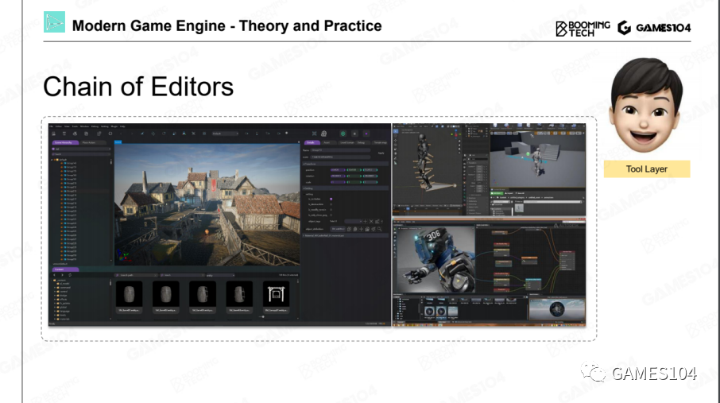
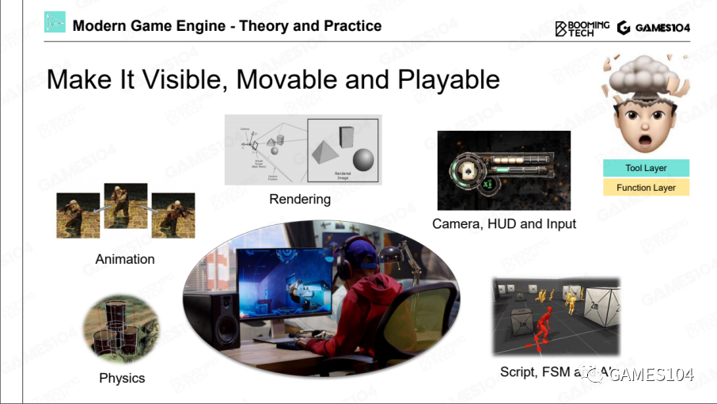
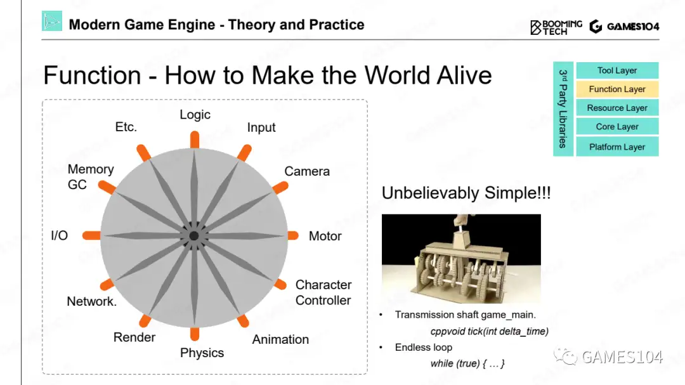
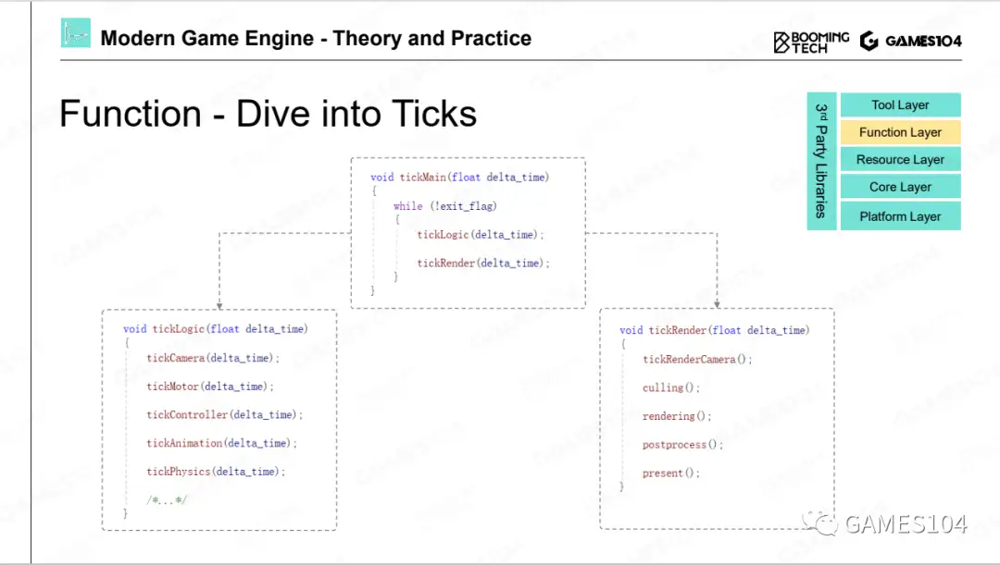
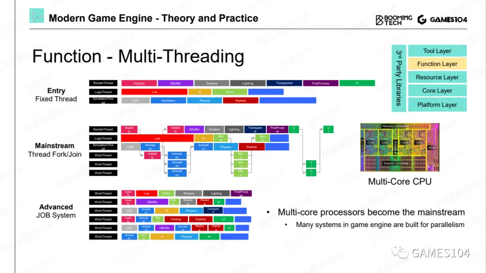
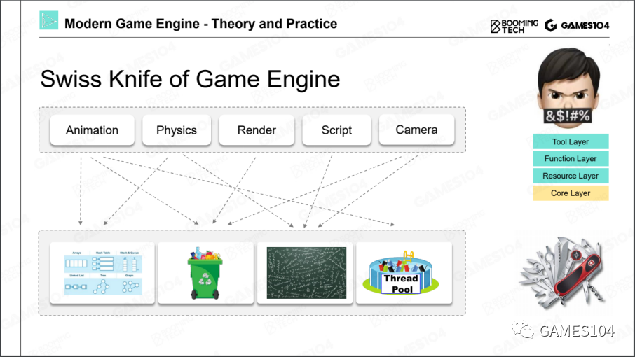
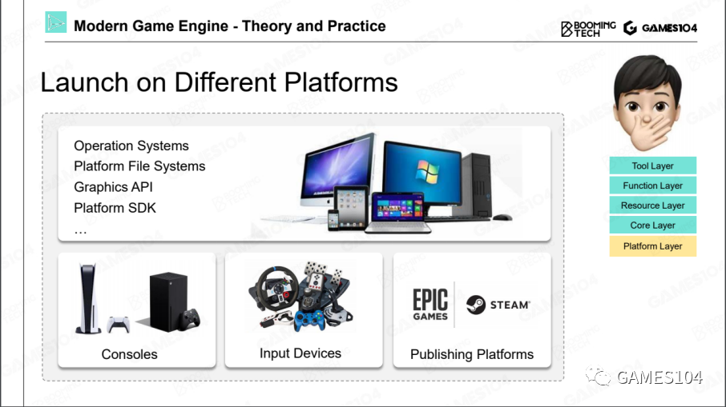
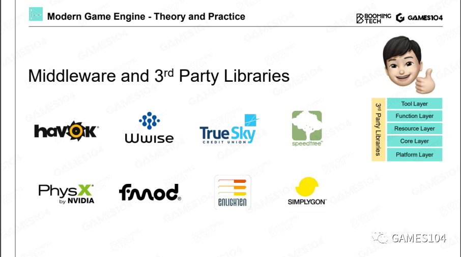

# 工具层

工具层实际上就是允许别人以Level Editor（地图编辑器）为中心形成的一系列编辑器。

- 蓝图编辑器
- 材质编辑器
- DCC——Digital Content Creation
- Asset Conditioning Pipeline

# 功能层

但功能层在很多引擎的架构中，它经常和具体的游戏关联在一起，因此，很多时候哪些功能属于游戏，哪些功能属于引擎，基本上就会在功能层上打架。

## Tick

在游戏的世界里面，是如何让这个世界动起来的？其实就是利用现代计算机非常高的计算速度，在每隔1/30秒把整个世界的逻辑和绘制全部跑了一遍。

*在实际源码里面不一定叫tick*

## Tick Logic 和 Tick Render

在Tick里面，就会出现两大神兽，一个叫Tick Logic，一个叫Tick Render。

1. TickLogic

负责这个世界模拟出来

2. TickRender

从某个观察视角，把能看到的世界绘制出来

3. 二者的关系

通常是先逻辑再绘制。  
逻辑和绘制一定要严格细分，一个没有受过系统训练的游戏引擎开发者，很容易把两边的代码写混在一起，但是，如果把绘制和逻辑分开，基本上无论怎么写，都不会重合在一起。

## 多核时代的游戏引擎架构

# 资源层

资源层是游戏非常核心的一个管理层，它管理能让整个游戏引擎跑起来的生态资源池的分配，以及每个资产实时的生命周期。

1. 资源 -> 资产
资源：来自各种DCC工具得到的各种格式的资源文件  
资产：一种统一的、高效的内部数据形式

2. GUID
每个资产设置一个唯一识别号。

3. 资产管理器(runtime asset manager)

这里最主要的管理是对所有这些资产的生命周期的管理。因为在游戏过程，资源要不停地加载和卸载。生命周期的管理会很大地影响系统的效率。

- handle系统，类似于指针的概念
- GC系统

# 核心层

为功能层提供与具体功能无关的通用能力，类似于操作系统。

- 数学库
- 数据结构
- 内存管理

为什么要自己写而不是直接使用已有的库，主要是效率方面的考虑，实现一套定制化的高效的通用能力。  

# 平台层

在引擎的这一层，就是处理各种各样的平台。

平台层的本质是在上面写核心代码/功能/逻辑，可以无视平台的差别。它把平台的差异性全部掩盖掉，提供RHI——Render Hardware Interface，把这些硬件的SDK差别封装起来。

# 第三方插件

有的插件是通过SDK的形式直接集成到我们的引擎里面去，就是说引擎里面编译的时候，就要把第三方代码编译进去。  
有的插件是一个独立的工具。它和引擎之间的数据交换，只是通过文件格式进行交换。

# 总结

分层架构的本质是封装。
1. 这个世界如果没有封装，只是把所有的概念散落，那是不可被理解，也是不可被管理的。
2. 在架构中有个基础原则：越往底层的东西越不要去动它。
3. 当我们未来在做任何一个需求的时候，同学们首先要去想的是做的这件事情应该属于哪一层，而不是着急地把算法写出来。
4. 各个层次之间的调用，一般只允许上面的层次调下面层次的功能，绝对不允许下面反向调上面一层的功能，这就是分层的一个核心的体系结构。