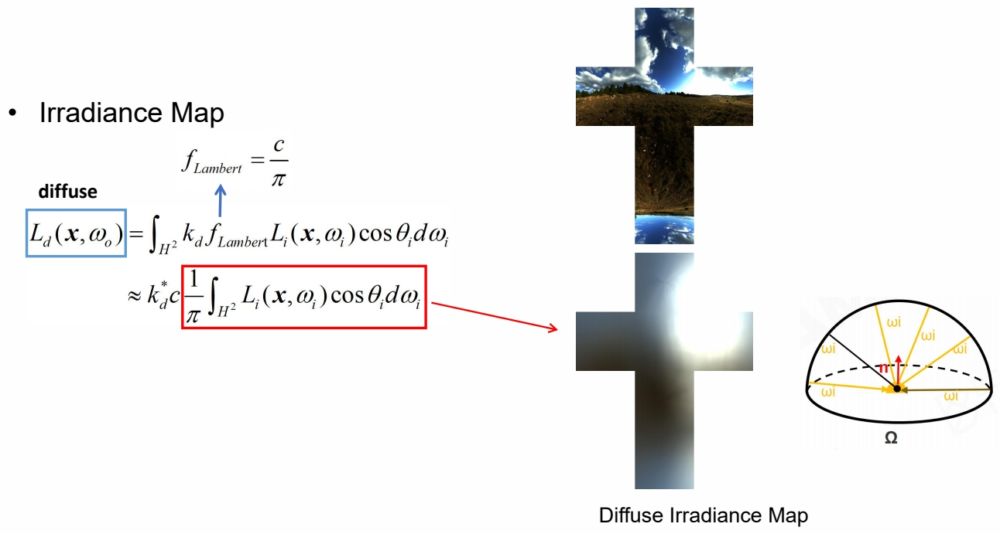
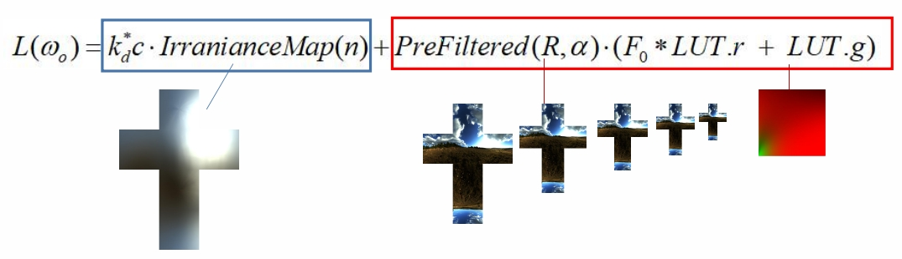
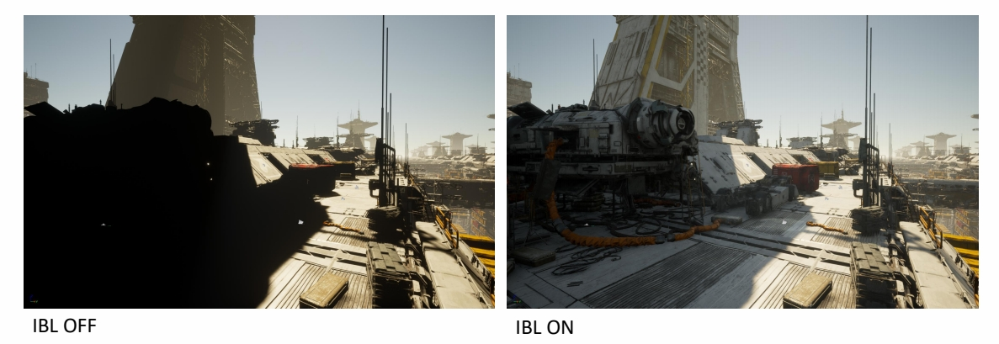
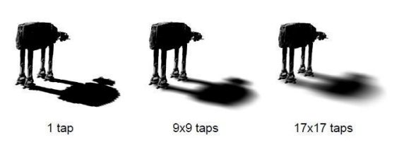
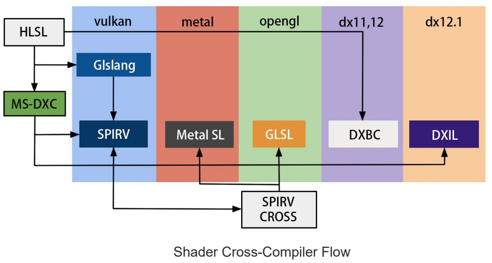

P61   
## Image-Based Lighting (IBL)

P62    
## Basic Idea of IBL

> 对真实的环境光照做预处理，快速地计算环境光照与材质之间的卷积。    
SH 的局限性：SH 的表达比较粗糙，只能有明暗的感觉，达不到场景细节感和凹凸感的效果。    

P64   
## Diffuse Irradiance Map

   

> 根据上文可知，\\(L_o（x，W_o）\\) 可以分为 diffuse 项和 specular 项。
Diffuse 须提前把卷积结果算好存下来。实时渲染时查表即可。    

P65   
## Specular Approximation

   

> Specular 项的推导比较复杂，且做了大量假设和近似。    
但 specular 结果与参数 roughness 有关。因此将不同 roughness 的结果存到了不同的 mipmap 中。因为，roughness 越大，对光的敏感度越低，可以放到 mipmap 的最低级。    
方法详见 GAMES 201。   

P66   
## Approximation: part (1/2)

   

   

P67   
## Approximation: part (2/2)

   

   

P68   
## Quick Shading with Precomputation

   

P69   
## Shading PBR with IBL

   

P70   
## Classic Shadow Solution

P71    
## Big World and Cascade Shadow

- Partition the frustum into multiple frustums   
- A shadow map is rendered for each sub frustum   
- The pixel shader then samples from the map that most closely matches the required resolution    

   

> 不同远近的物体的 shadow，对精度的要求是不一样的。这样，近处 shadow 足够清晰，远处 shadow 足够稀疏。     

P73   
## Blend between Cascade Layers

1. A visible seam can be seen where cascades overlap    
2. between cascade layers because the resolution does not match    
3. The shader then linearly interpolates between the two values based on the pixel's location in the blend band    

P74    
## Pros and Cons of Cascade Shadow

- Pros
  - best way to prevalent errors with shadowing: perspective aliasing    
  - fast to generate depth map, 3x up when depth writing only   
  - provide fairly good results   
- Cons   
  - Nearly impossible to generate high quality area shadows   
  - No colored shadows. Translucent surfaces cast opaque shadows   

P75   
## Hard Shadow vs Realistic Shadow

   

P76   
## PCF - Percentage Closer Filter

- **Target problem**   
  - The shadows that result from shadow mapping aliasing is serious   
- **Basic idea**   
  - Sample from the shadow map around the current pixel and compare its depth to all the samples    
  - By averaging out the results we get a smoother line between light and shadow    

  

> 用滤波的法做软阴影。    

P77    
## PCSS - Percentage Closer Soft Shadow

- **Target problem**   
  - Suffers from aliasing and under sampling artifacts   
- **Basic idea**   
  - Search the shadow map and average the depths that
are closer to the light source   
  - Using a parallel planes approximation   

   

P78    
## Variance Soft Shadow Map

- **Target problem**   
  - Rendering plausible soft shadow in real-time    
- **Basic idea**   
  - Based on Chebyshev‘s inequality, using the average and variance of depth, we can approximate the percentage of depth distribution directly instead of comparing a single depth to a particular region(PCSS)     

   

P79    
## Summary of Popular AAA Rendering

光：Lightmap + Light probe    
材质： PBR + IBL(环境光)    
阴影：Cascade shadow + VSSM   

P80    
# Moving Wave of High Quality

P81   
## Quick Evolving of GPU

- More flexible new shader model   
  - Compute shader   
  - Mesh shader   
  - Ray-tracing shader   
- High performance parallel architecture   
  - Warp or wave architecture   
- Fully opened graphics API    
  - DirectX 12 and Vulkan   

P82   
## Real-Time Ray-Tracing on GPU

   

P83   
## Real-Time Global Illumination

Screen-space GI    
SDF Based GI   
Voxel-Based GI（SVOGI/VXGI）   
RSM / RTX GI   

P86    
## Shader Management

P90    
## Uber Shader and Variants

A combination of shader for all possible light types, render passes and material types   

- Shared many state and codes    
- Compile to many variant short shaders by pre-defined macro   

   

> 利用 uber 写好少量 shader 模版，然后自动生成大量 shader.    

P92   
## Cross Platform Shader Compile

   

127127127127