P5   
> 地形系统

P8    
## Simple Idea - Heightfield

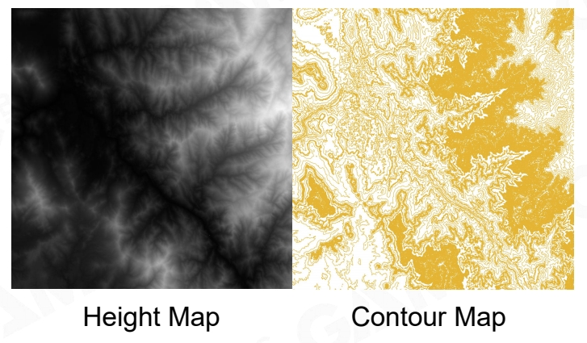   

P10   
## Render Terrain with Heightfield

> 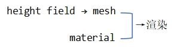   
存在的问题：数据量巨大    

   

P12    
## Adaptive Mesh Tessellation

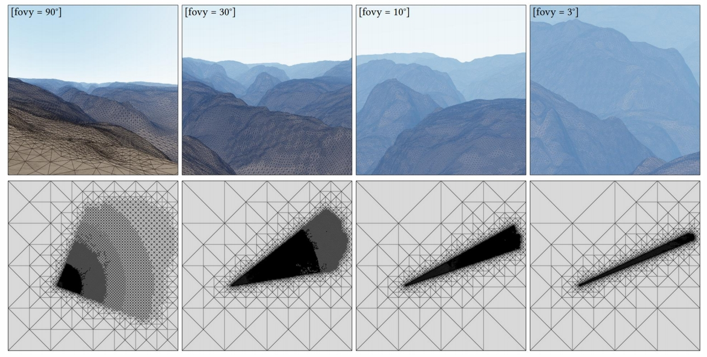   

> LOD_2 Level Of Detail     
等角色 LOD 不同的是，地形是连续的。    
(1) 近处密集，远处稀疏    
(2) FOV 小密集，FOV 大稀疏    
(3) 地起伏大(有明显误差)密集，起伏小稀疏   

P13    
## Two Golden Rules of Optimization

**View-dependent error bound**   
- Distance to camera and FoV   
- Error compare to ground truth (pre-computation)   

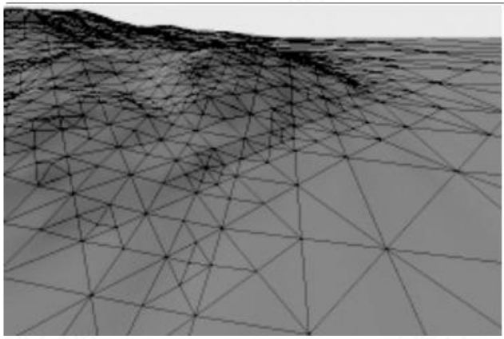   

P14   
## Triangle-Based Subdivision

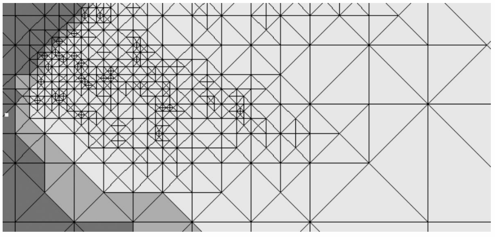   

P15   
## Subdivision and T-Junctions    

Continuously partitioning triangles and their    
children based on the idea of binary trees     

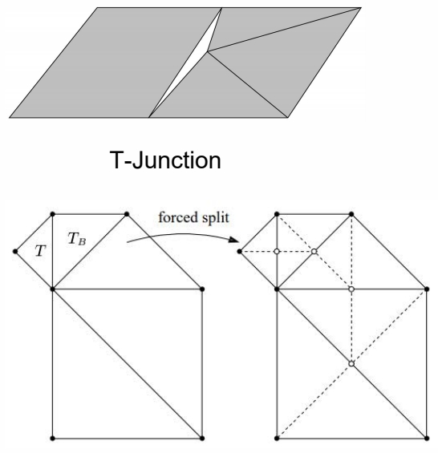   
  
> T-Junction：一条边的两边切分不致导数的 BuG。    
解决方法：强制稀疏侧向密集侧对齐    

P17    
## QuadTree-Based Subdivision

**Pros**    
- Easy to construct     
- Easy management of data under geospatial, including objects culling and data streaming     

**Cons**    
- Mesh subdivision is not as flexible as triangle mesh    
- The grid level of the leaf nodes needs to be consistent   

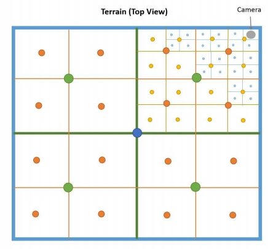   

> 三角形不符合构建地形的直觉，更常用是四边形。   
也会有 T-Junctions 问题。解决方法：吸附。    
吸附不改变数据结构，实现更容易。     

P19    
## Solving T-Junctions among Quad Grids

   

P21    
## Triangulated Irregular Network (TIN)

   

> 把 height field 转化为不规则三角形。    
优点：(1) 三角形少很多    
(2) 与地形特征更匹配(顶点的位置)    

P23    
## Triangulated Irregular Network vs. Adpative Tessellation

Pros   
- Easy in runtime rendeirng   
- Less triangls in certain terrain types   

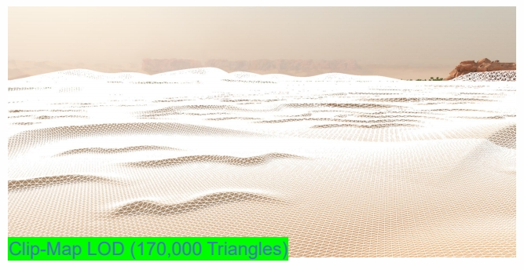   

Cons    
- Requires certain pre-processing steps   
- Poor reusability   

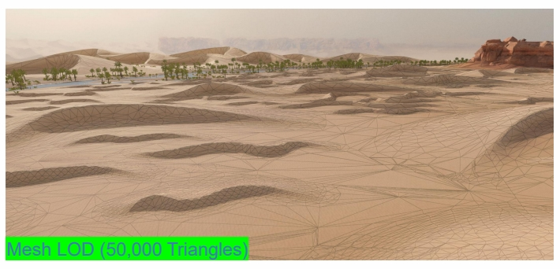   

GDC2021 Boots on the Ground: The Terrain of Call of Duty      

P27    
## Mesh Shader Pipeline 

- Amplification Shader Stage - decides how many Mesh shader groups to run and passes data to those groups   
- Mesh Shader Stage - produces a semi-regular tessellation pattern for each patch, and outputs comprise vertices and primitives    

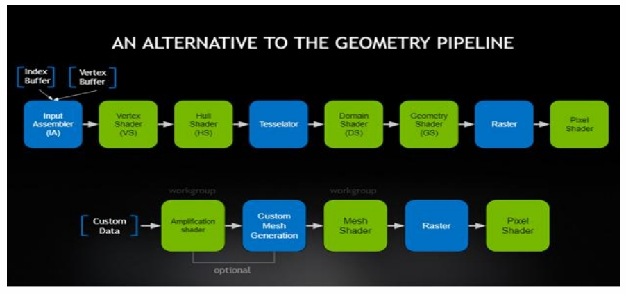   

P30    
Non-Heightfield Terrain

P31   
## Dig a Hole in Terrain

   

P32   
## Crazy Idea - Volumetric Representation

In 3D computer graphics, a voxel represents a value on a regular grid in three-dimensional space. As pixels in a 2D     
bitmap, voxels themselves do not typically have their position (i.e. coordinates) explicitly encoded with their values     

P33   
## Marching Cubes

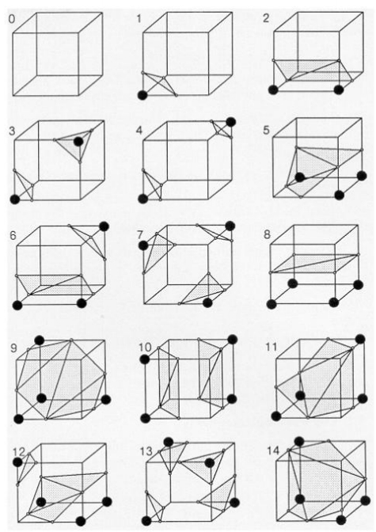   

MARCHING CUBES: A HIGH RESOLUTION 3D SURFACE CONSTRUCTION ALGORITHM'; Computer Graphics, Volume 21, Number 4, July 1987    

P36    
Paint Terrain Materials

P38    
## Terrain Materials

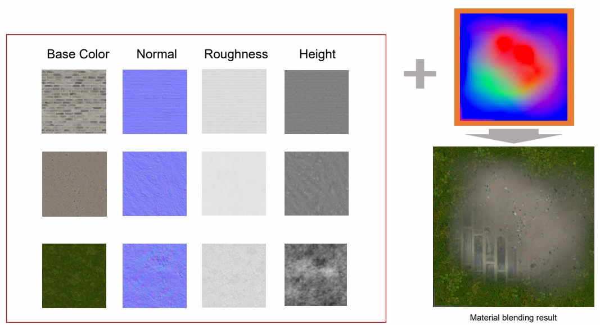   

P39    
## Simple Texture Splatting

   

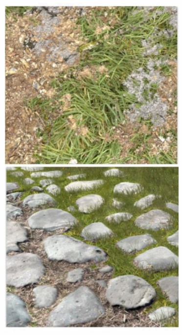   

P40    
## Advanced Texture Splatting

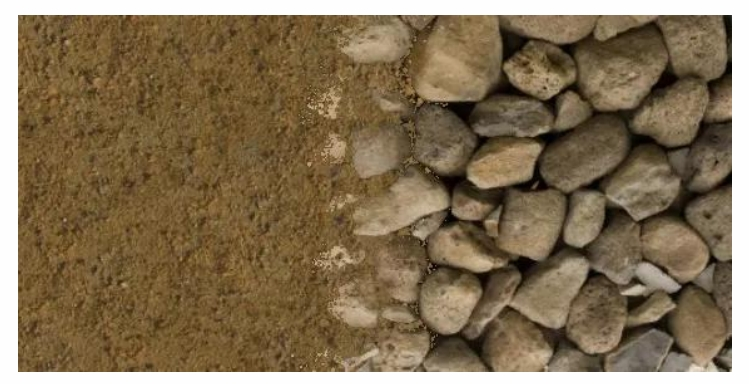   

Blending with Height    

float3 blend(float4 texture1, float height1, float4 texture2, float height2)    
{    
return height1 > height2 ? texture1.rgb : texture2.rgb;    
}       

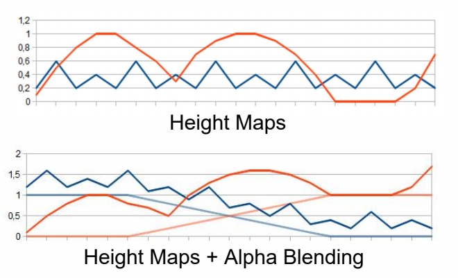   

P41    
## Advanced Texture Splatting - Biased

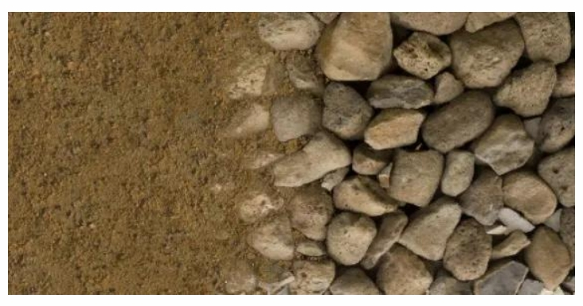   

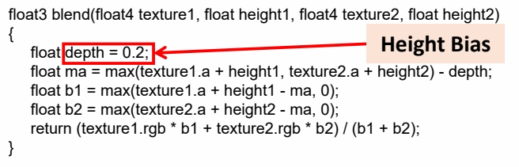   

   

**Links:**     
<https://www.gamedeveloper.com/programming/advanced-terrain-texture-splatting>    

P42   
## Sampling from Material Texture Array

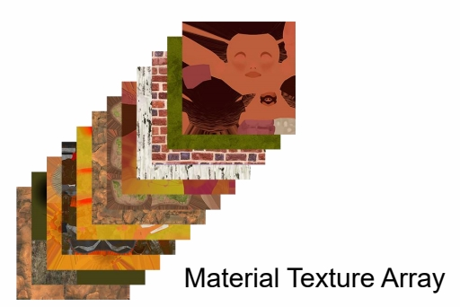   

P43   
## Parallax and Displacement Mapping

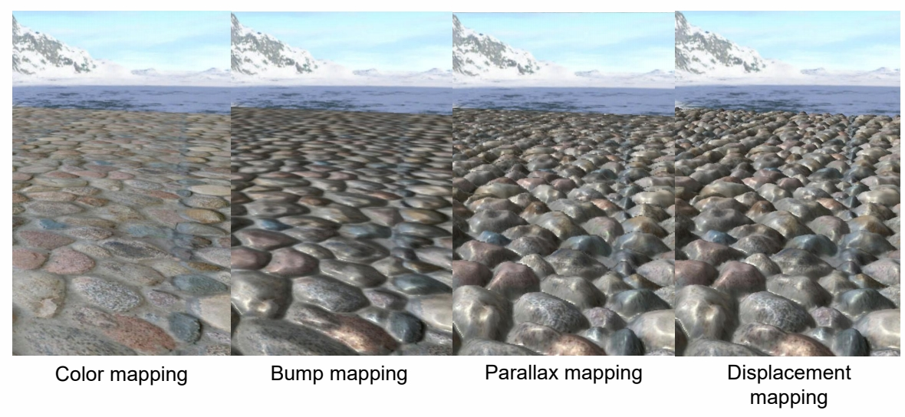   

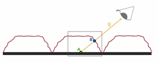   

Parallax Mapping: Due to the height of the surface, the eye sees point B instead of point A. It creates a sense of dimensionality     

P44    
## Expensive Material Blending    

- **Many Texturing** - Low performance when multiple materials are sampled too many times    

- Huge Splat Map - We only see a small set of terrain, but we load splat maps for 100 square km into video memory      

   

P45    
## Virtual Texture

- Build a virtual indexed texture to represent all blended terrain materials for whole scene    
- Only load materials data of tiles based on view- depend LOD   
- Pre-bake materials blending into tile and store them into physical textures   

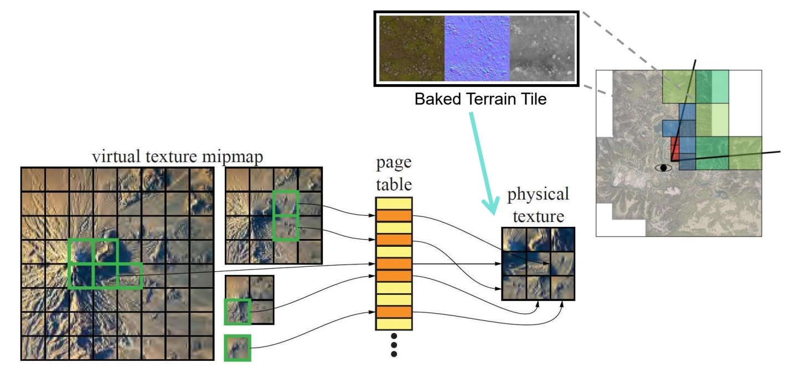   

P46    
## VT Implementation, DirectStorage & DMA

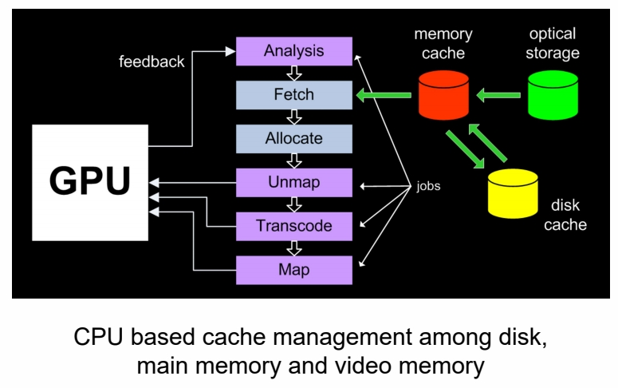   

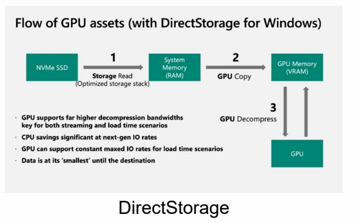   

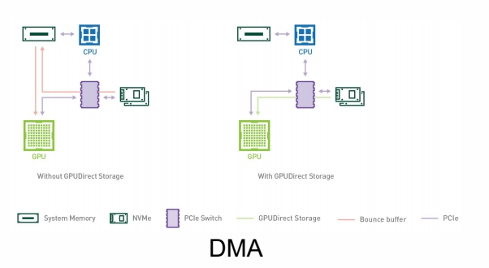   

P47    
## Floating-point Precision Error

P48    
## Camera-Relative Rendering

- Translates objects by the negated world space camera position before any other geometric transformations affect them    
- It then sets the world space camera position to 0 and modifies all relevant matrices accordingly    

P49    
Integration with other world elements (rocks, trees, grass)    

P50    
## Tree Rendering

P51    
## Decorator Rendering

P52    
## Road and Decals Rendering

P54   
## Procedure Terrain Creation

P55    
## Sky and Atmosphere

P59    
## How to "Paint" Everything in the Sky

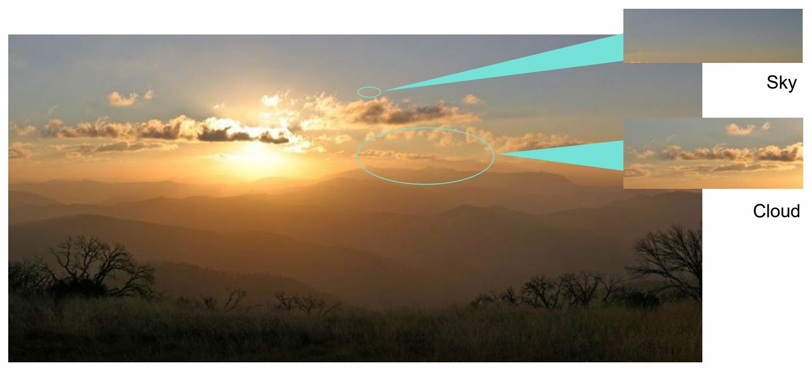   

P60   
## Atmosphere

P61    
## Analytic Atmosphere Appearance Modeling

$$
\mathbb{F} (\theta ,\gamma )=(1+Ae^{\frac{B}{\cos \theta +0.01}})\cdot (C+De^{E\gamma }+F\cos ^2\gamma +G\cdot \chi (H,\gamma )+I\cdot \cos ^ {\frac{1}{2} }\theta )  
$$

$$
L_\lambda =\mathbb{F} (\theta ,\gamma )\cdot L_{M\lambda} 
$$

   

**Pros**    
- Calculation is simple and efficient    
**Cons**   
- Limited to ground view   
- Atmosphere parameters can’t be changed freely    

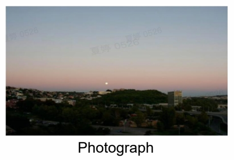   

   

An Analytic Model for Full Spectral Sky-dome Radiance, ACM Trans 2012    

P62   
## Participating Media

- Volume filled with particles    
- Interact differently with light depending on its composition   

P63    
## How Light Interacts with Participating Media Particles?

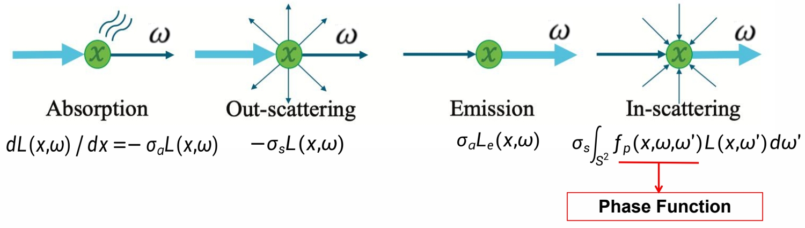   

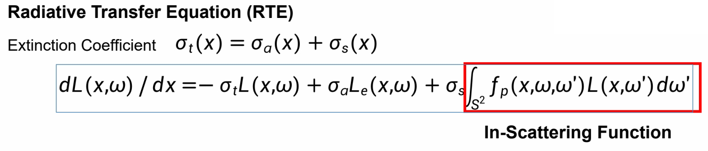   

P64    
## Volume Rendering Equation (VRE)

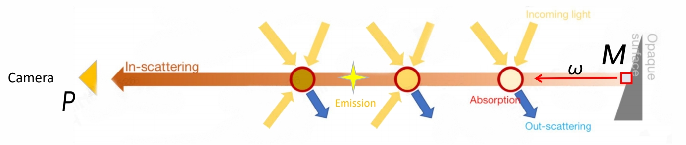  

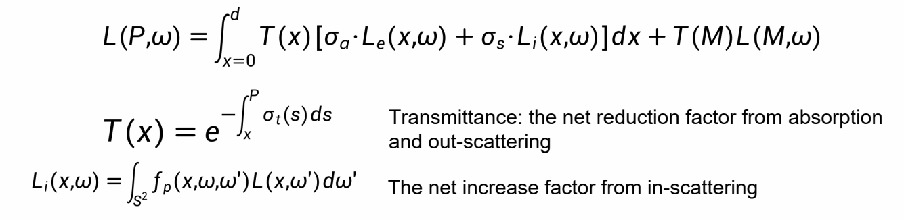  

P65    
## Real Physics in Atmosphere

P66   
## Scattering Types

- **Rayleigh Scattering**   
Scattering of light by particles that have a diameter **much smaller than** the wavelength of the radiation (eg. air molecules)     

- **Mie scattering**   
Scattering of light by particles that have a diameter **similar to or larger than** the wavelength of the incident light (eg. aerosols)    

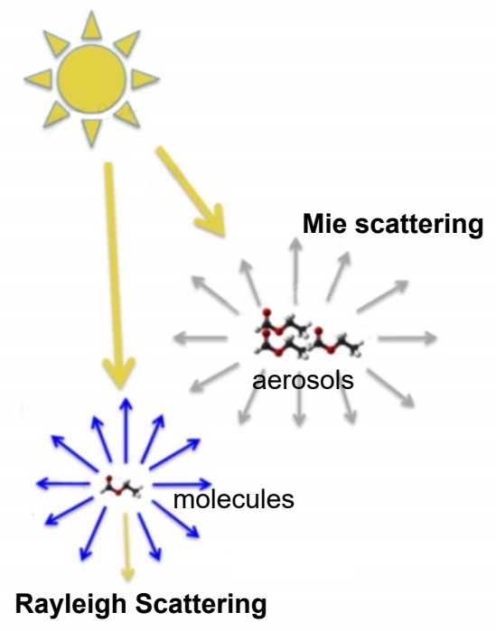  

P67    
## Rayleigh Scattering

- Certain directions receive more light than others front-back symmetry    
- Shorter wavelengths (eg. blue) are scattered more strongly than longer wavelengths (eg. red)    

  

**Rayleigh Scattering Distribution**

P68    
## Rayleigh Scattering Equation

  

P69   
## Why Sky is Blue

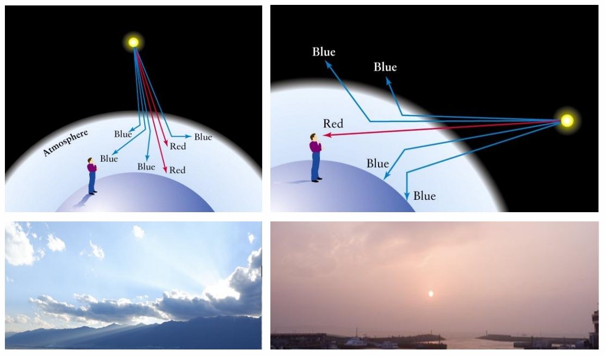  

P70   
## Mie Scattering

- Scatter light of all wavelength nearly equally
- Exhibit a strong forward directivity

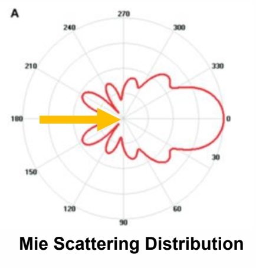  

P71   
## Mie Scattering Equation

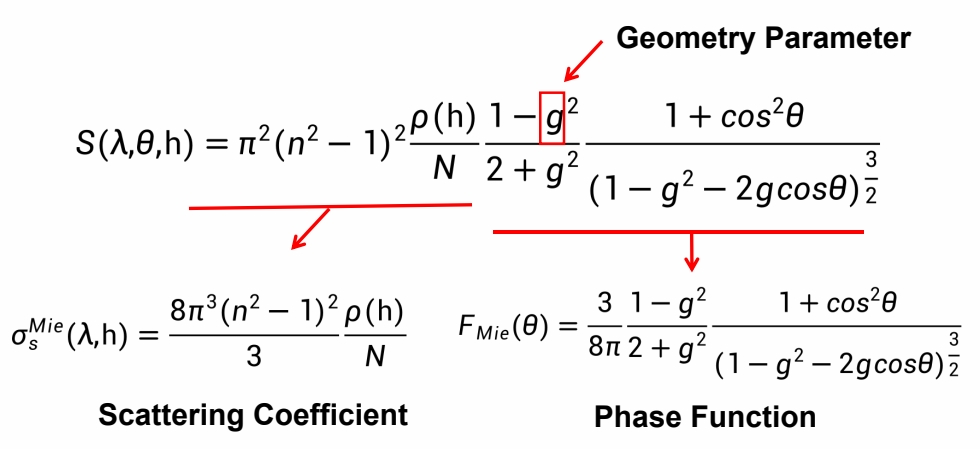  

- g > 0, scatters more forward Mie scattering    
- g < 0, scatters more backward   
- g = 0, Rayleigh scattering   

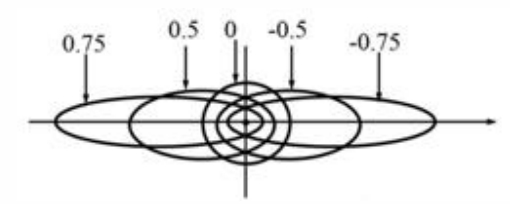  

P72    
## Mie Scattering in Daily Life

- Exhibit a strong forward directivity (halo effects around sun)    
- Scatter light of all wavelength nearly equally (fog effects)    

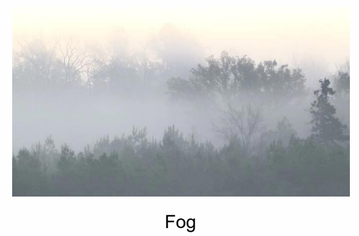  

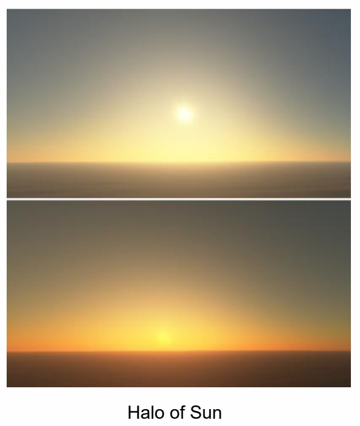  

P74   
## Single Scattering vs. Multi Scattering

  

P75   
## Single Scattering vs. Multi Scattering   

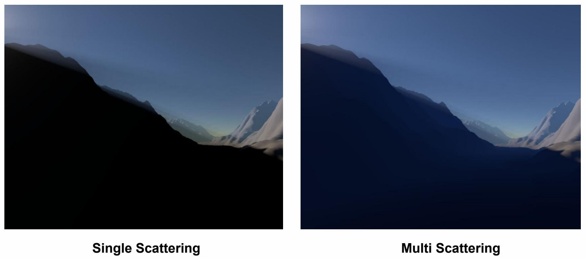  

P76    
## Ray Marching

- **Ray marching** is a popular method to integrate function along a path   
- We use ray marching to calculate final radiance for a given point by single scattering   
- The integrated radiance is usually stored in **look-up tables (LUT)**   

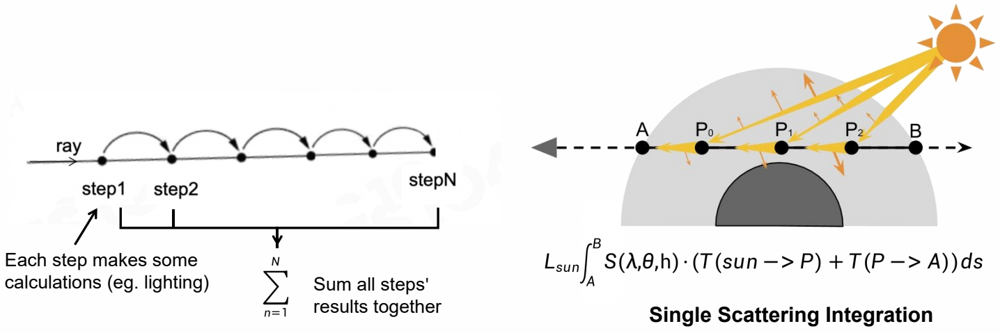  

P77   
## Precomputed Atmospheric Scattering

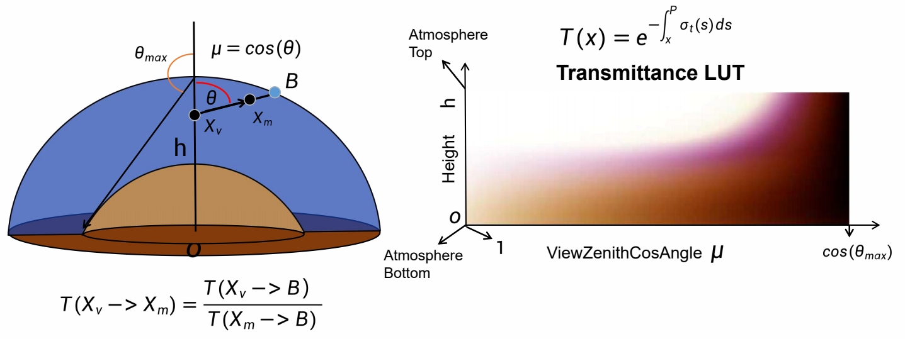  

P78   
## Precomputed Atmospheric Scattering

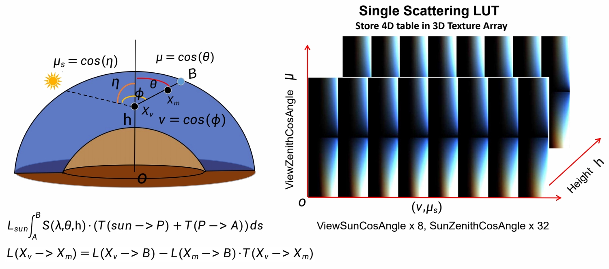  

P79   
## Precomputed Atmospheric Scattering

**Multi Scattering LUT**

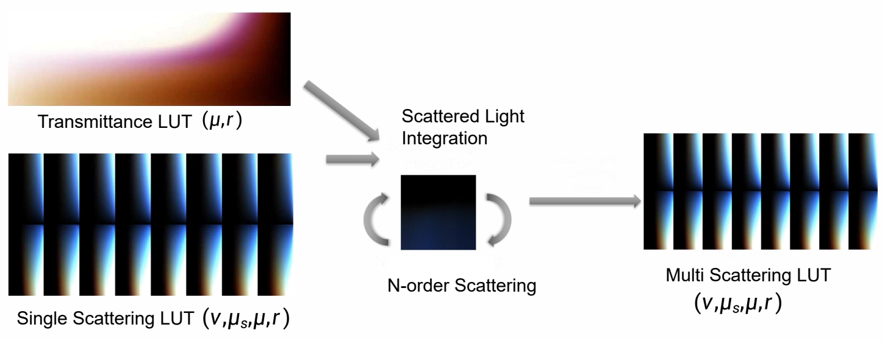  

P81    
## Challenges of Precomputed Atmospheric Scattering

- Precomputation Cost    
  - Multi-scattering iterations are very expensive   
  - Hard to generate atmosphere LUT on low-end devices (ie. mobile)   
- Authoring and **Dynamic Adjustment of** Environments   
  - Artist can't change scattering coefficients on the fly   
  - Hard to render effects like weather from sunny to rain fog, space travel among planets   
- Runtime Rendering Cost   
  - Expensive **per-pixel multi high dimensional texture sampling** for transmittance LUT and multi scattering LUT (always need to down-sample for efficiency)   

**A Scalable and Production Ready Sky and Atmosphere Rendering Technique**     
<https://diglib.eg.org/bitstream/handle/10.1111/cgf14050/v39i4pp013-022.pdf>    

P82   
## Production Friendly Quick Sky and Atmosphere Rendering

Simplify Multi-scattering Assumption   
- Scattering events with order greater or equal to 2 are executed using an **isotropic phase function**   
- All points within the neighborhood of the position we currently shade **receive the same amount of second order scattered light**   
- **Visibility is ignored**     

$$
G_{n+1}=G_n\ast f _{ms}
$$

$$
\mathbf{ F_{ms}=1+f_{ms}+f^2_{ms}+f^3_{ms}+\dots = \frac{1}{1-\mathbf{f_{ms}} } }
$$

$$
\mathbf{\Psi _{ms} }=\mathbf{L_{2^{nd}order} F_{ms} }
$$

P83   
## Production Friendly Quick Sky and Atmosphere Rendering

Fixed view position and sun position to remove 2 dimensions out of LUT   

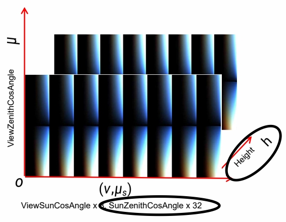  

P84    
## Production Friendly Quick Sky and Atmosphere Rendering

- Generated a 3D LUT to evaluate aerial-perspective effects by ray marching    

  

P85    
## Good Balance of Performance and Effect

- Scalable from mobile to high-end PCs

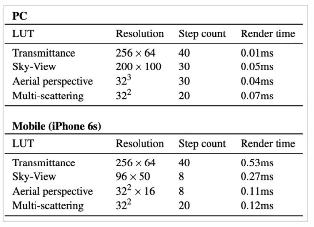  

Performance for each step of method, as measured on PC (NV 1080) and a mobile device (iPhone 6s)    

P88    
## Cloud Type

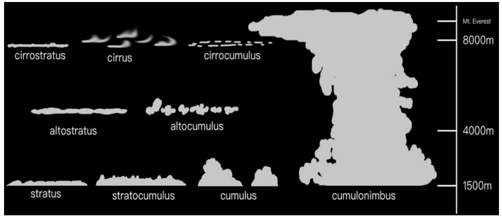  

P89   
## Mesh-Based Cloud Modeling

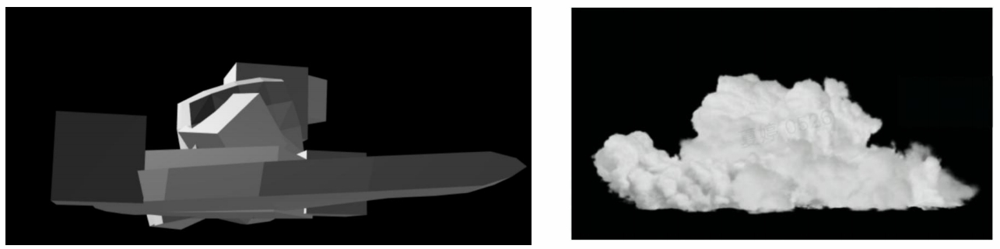  

**Pros**   
- High quality   
**Cons**   
- Overall expensive   
- Do not support dynamic weather   

P90   
## Billboard Cloud

**Pros**   
- Efficient   
**Cons**   
- Limited visual effect   
- Limited cloud type    

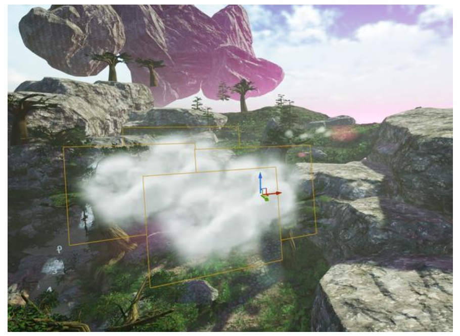  

P91    
## Volumetric Cloud Modeling

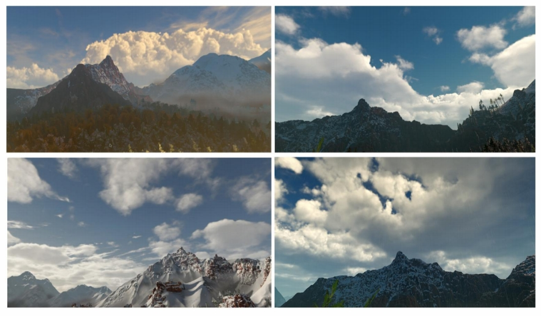  

**Pros**    
- Realistic cloud shapes    
- Large scale clouds possible    
- Dynamic weather supported    
- Dynamic volumetric lighting and shadowing   
**Cons**   
- Efficiency must be considered    

P92    
## Weather Texture

  

  

P93   
## Noise Functions

  

  

P94    
## Cloud Density Model

  

P95    
## Rendering Cloud by Ray Marching

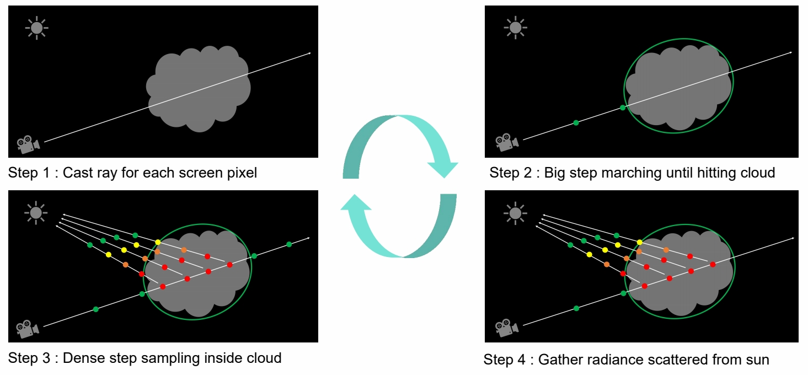  
