P2     
## Ambient Occlusion

P3   
## AO Off

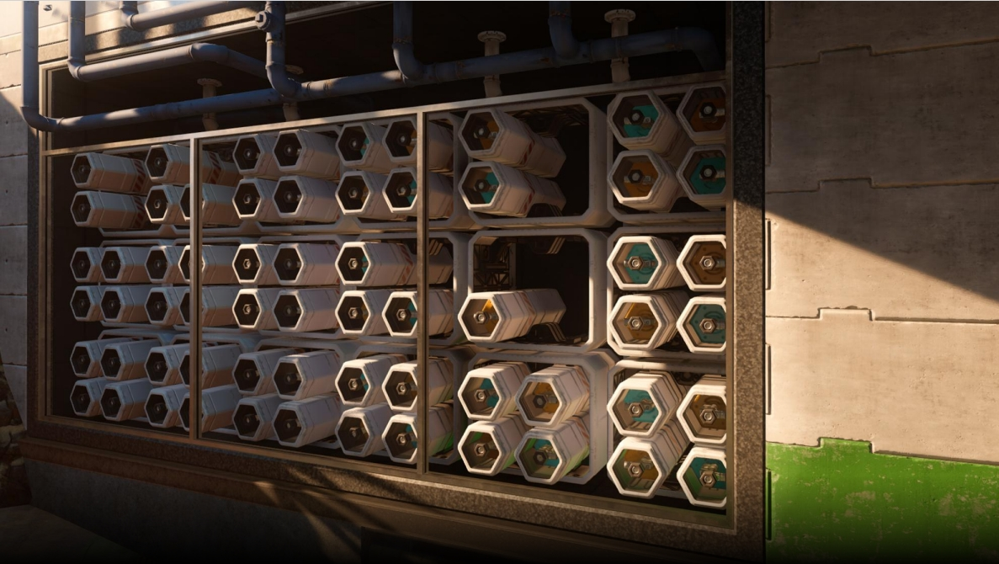   

P4   
## AO On

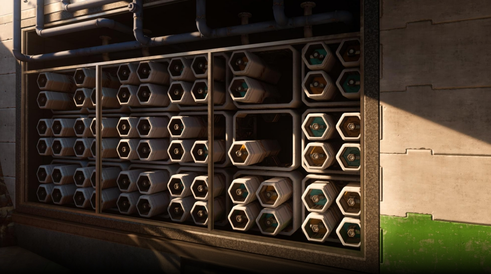   

P5   
## Ambient Occlusion

- Approximation of attenuation of ambient light due to occlusion    

   

P6    
## Precomputed AO

Using ray tracing to compute the AO offline and store the result into texture, which is widely used in object modeling process   
- Extra storage cost    
- Only apply to static object    

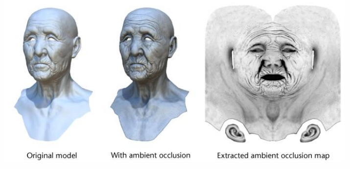   

P7    
## Screen Space Ambient Occlusion (SSAO)

   

$$
A(p)=1-\frac{Occlusion}{N} 
$$

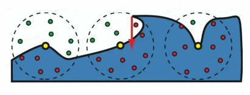   

- Generate N random samples in a sphere around each pixel p in view space   
- Test sample occlusions by comparing depth against depth buffer   
- Average visibility of sample points to approximate AO   

P8    
## SSAO+

- Recall the AO equation is acutally done on the normal-oriented hemisphere    

   

   

P11    
## HBAO - Horizon-based Ambient Occlusion

- Use the depth buffer as a heightfield on 2D surface   
- Rays that below the horizon angle are occluded   

   

   

P12    
## HBAO Implementation

- Use the depth buffer as a heightfield on 2D surface    
- Trace rays directly in 2D and approximate AO from horizon angle   

   

P13    
## GTAO - Ground Truth-based Ambient Occlusion

GTAO introduces the missing cosine factor, removes the attenuation function, and add a fast approximation of multi bounce    

   

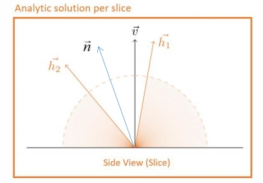   

   

P14    
## GTAO - Ground Truth-based Ambient Occlusion

Add **multiple bounces** by fitting a cubic polynomial per albedo   

   

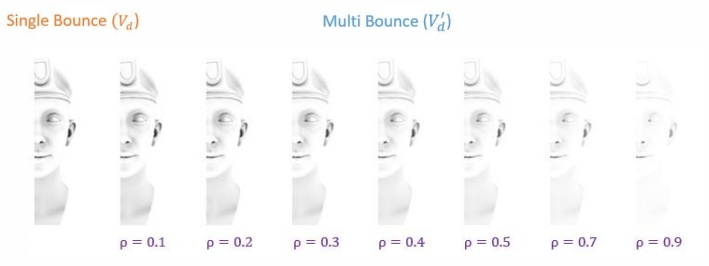   

   

P15    
## Ray-Tracing Ambient Occlusion

- Casting rays from each screen pixel using RTT hardware    
- 1 spp(sample per-pixel) works well for far-field occlusion    
- With 2-4 spp, can recover detailed occlusion in contact region   

P16    
## Fog Everything

P17    
## Depth Fog

Linear fog:   
factor = (end-z)/(end-start)   
Exp fog:   
factor = exp(- density\\(\ast \\)z)   
**Exp Squared fog:**    
factor = exp(- (density\\(\ast \\)z)^2)   

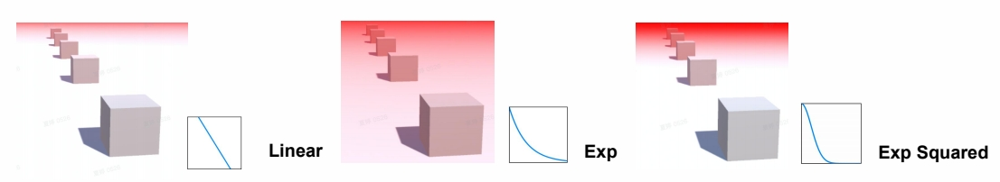   

P18    
## Height Fog

- Height Fog integration along view diretion   

$$
\mathrm{D(h)=D _{max}\cdot e ^{-\sigma \cdot max(h-H _s,0)}}
$$

FogDensitylntegration      

$$
\begin{align*}
 = & \mathrm {D_{\max}\cdot d\int_{0}^{1}e^{-\sigma \cdot \max (v_z+t\ast d_z-H_s,0)}dt} \\\\
  = & \mathrm {D_{\max}\cdot d\cdot e^{-\sigma \cdot \max(v_z-Hs,0)}\frac{1-e^{-\sigma \cdot d_z}}{\sigma \cdot d_z}}
\end{align*}
$$

- Fog color after transmission

FogInscatter=1-exp\\(^{-FogDensityIntegration}\\)    
FinalColor=FogColor\\(\cdot\\) FogInscatter    

   

P19   
## Voxel-based Volumetric Fog

   

P20   
## Anti-aliasing

P21   
## Reason of Aliasing

- Aliasing is a series of rendering artifact which is caused by high-frequency signal vs. insufficient sampling of limited rendering resolutions   

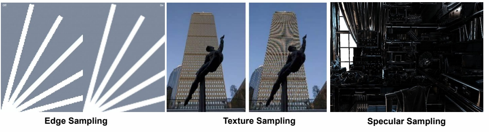   

P22    
## Anti-aliasing

- The general strategy of screen-based antialiasing schemes is using a sampling pattern to **get more samples** and then **weight and sum samples** to produce a pixel color    

$$
p(x,y)=\sum_{i=1}^{n}  w_ic(i,x,y)
$$

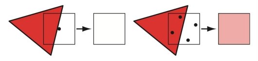   

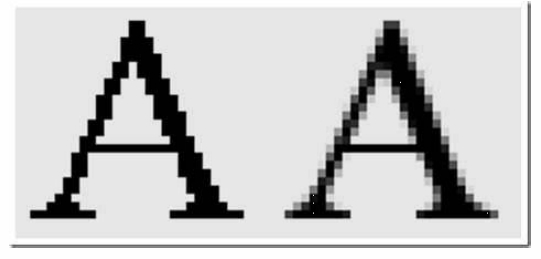   

P23    
## Super-sample AA (SSAA) and Multi-sample AA (MSAA)

- Super sampling is the most straightforward solution to solve **AA**    

   

   

P24    
##　FXAA (Fast Approximate Anti-aliasing)

Anti-aliasing based on 1x rendered image　　　

－ Find edge pixels by luminance　　　
－ Compute offset for every edge pixel　　　
－ Re-sample edge pixel by its offset to blend with a neighbor　　　

   

   

P26   
## Edge Searching Algorithm

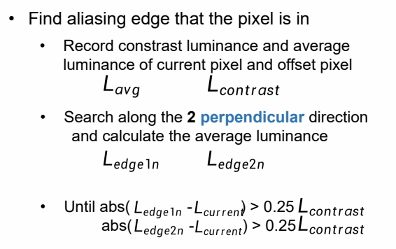   

   

P27    
## Calculate Blend Coefficient

- Compute blender coefficient

**targetP** is the nearer edge end of **CurrentP**    

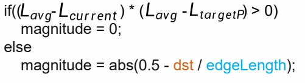   

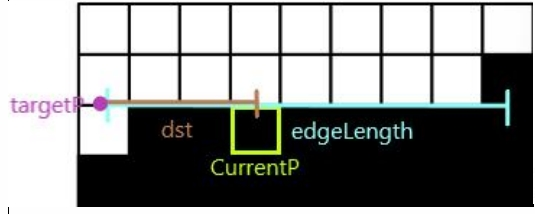   

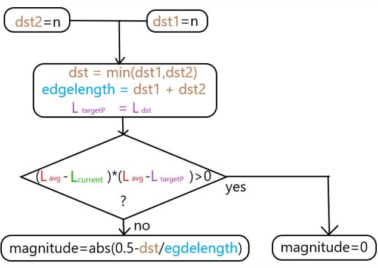   

P28   
## Blend Nearby Pixels

- Compute blender coefficient   

   

**PixelNewColor = Texture(CurrentP_UV + offset_direction * offset_magnitude )**

P29   
## FXAA Result

   

P30   
## TAA (Temporal Anti-aliasing)

Utilize spatial-**temporal** filtering methods to improve AA stability **in motion**   

   

   

P31   
## TAA (Temporal Anti-aliasing)

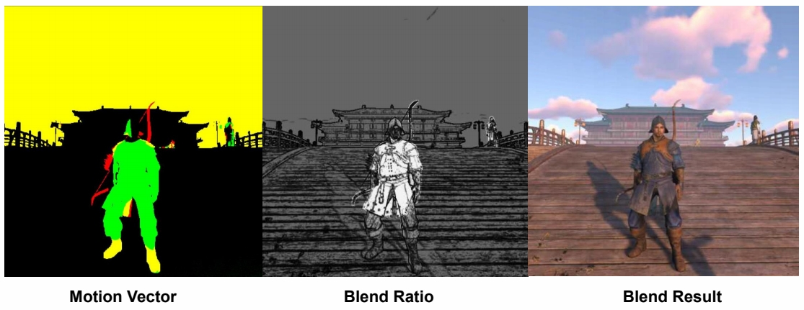   

