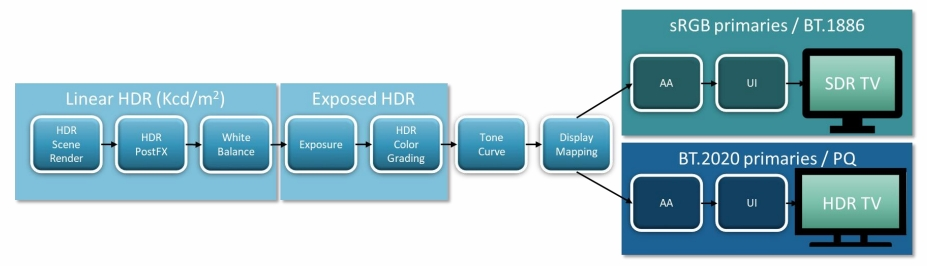
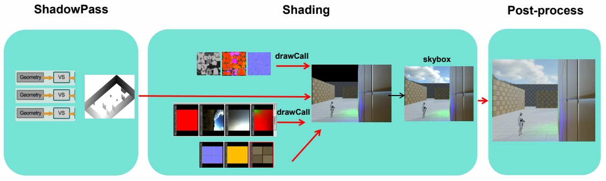
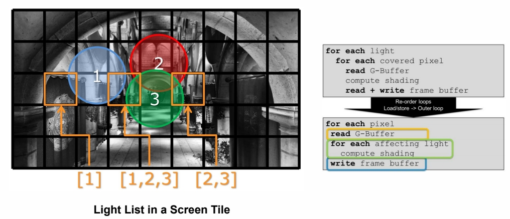
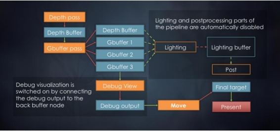
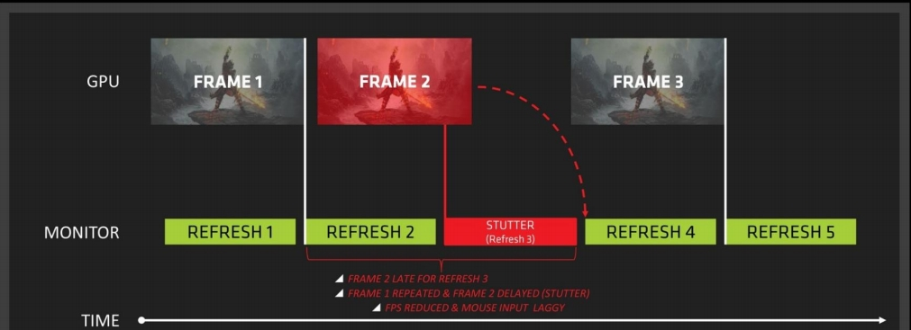

P34   
## Post-process

Post-process in 3D Graphics refers to any algorithm that will be applied to the final image. It can be done for stylistic reasons (color correction, contrast, etc.) or for realistic reasons (tone mapping, depth of field, etc.)    

   

P35   
## Bloom Effect

P36   
## What is Bloom

- The physical basis of bloom is that, in the real world, lenses can never focus perfectly    
- Even a perfect lens will convolve the incoming image with an <u>**Airy disk**</U>    

   

P37   
## Detect Bright Area by Threshold

   

Find Luminance (Y) apply the standard coefficients for sRGB:    

$$
Y=R_{lin}\ast 0.2126+G_{lin}\ast 0.7152+B_{lin}\ast 0.0722
$$

> 取出非常亮的部分，做与 5\\(\times \\)5 高斯 blur。    

P38   
## Gaussian Blur   

   

P39    
## Pyramid Guassian Blur

   

We can't do all that filtering at high resolution, so we need a way to **downsample** and **upsample** the image Need a weight coefficient to tweak final effect   

> 在低精度图上 blur 再放大，可以得到大区域的 blur 效果同时较小的计算量。   

P40   
## Bloom Composite

   

P41   
   

P42   
## Tone Mapping

> 真实世界的亮度 range 非常大，如果曝光没调好，会出现亮部过亮或暗部过暗的效果。    

P43   
## Tone Mapping

- No way to directly display HDR image in a SDR device    
- The purpose of the **Tone Mapping** function is to map the wide range of high dynamic range (HDR) colors into standard dynamic range (SDR) that a display can output    

   

> 用一条曲线把 HDR 映射到 SDR。   
filmic curve 是一个拟合出来的所项式曲线。      

P45   
## ACES

- **A**cademy **C**olor **E**ncoding **S**ystem    
  - Primarily for Film & Animation    
  - Interesting paradigms and transformations   
- The useful bits   
  - Applying Color Grading in HDR is good   
  - The idea of a fixed pipeline up to the final OTD transforms stage is good   
     - Separates artistic intent from the mechanics of supporting different devices   

   

> ACES 曲线不但效果更好，还可以通注增加一个后处理，无差别适配到任何终端。    

P46    
## HDR and SDR Pipeline

- Visual consistency between HDR / SDR   
- Similar SDR results to previous SDR color pipeline   
- High quality   
- High performance   
- Minimal disruption to art teams   
  - Simple transition from current color pipeline   
  - Minimal additional overhead for mastering HDR *and* SDR   

   

P47    
## Tone Mapping Curve Comparison

   
   

P48   
## Color Grading

P49   
## Lookup Table (LUT)

- LUT is used to remap the input color values of source pixels to new output values based on data contained within the LUT    

- A LUT can be considered as a kind of color preset that can be applied to image or footage    

 

> 用一个表格实现从原始色相空间到目标色相空间的映射。    

P53    
## Rendering Pipeline

P59   
## Rendering Pipeline

- **Rendering pipeline** is the management order of all rendering operation execution and resource allocation    

 

P60   
## Forward Rendering

for n meshes   
\\(\quad\\) for m lights    
\\(\quad \quad\\)color += shading(mesh, light)    

P61    
## Sort and Render Transparent after Opaque Objects

 

> 透明物质必须最后绘制。    
多个透明物质则由远及近绘制，因为不同绘制顺序产生的结果是不一样的。   
透明物体的排序很容易引起各种 BuG。    
十几年前的主流 Pipeline。    

P64    
## Deferred Rendering

   

 

 

 

> 由于光的种类非常复杂，引入延迟渲染技术，即先绘制物体，再考虑与光的关系。   
近十年最主流的 Pipeline.    

P65    
## Deferred Rendering

**Pros**   
- Lighting is only computed for visible fragments     
- The data from the G-Buffer can be used for post- processing   

**Cons**   
- High memory and bandwidth cost     
- Not supporting transparent object     
- Not friendly to MSAA    

   

P66   
## Pilot Engine Deferred Rendering

   

P67    
## Tile-based Rendering

     

     

     

> 这个 pipeline 用于移动端。因为移动端最关心发热问题。    
DRAM 存储大、速度慢、功耗高。On-chip 中的 SRAM 则相反。    
因此，把整个 G-buffer 切成小的 tile 在 SRAM 计算，算好存成framebuffer。    

P68   
## Light Culling by Tiles

     

P69    
## Depth Range Optimization

- Get Min/Max depth per tile from Pre-z pass    
- Test depth bounds for each light   

     

> tile-based 是现代引擎的主流方案。    
tile 的额外好处是简化光的计算。    

P71    
## Forward+ (Tile-based Forward) Rendering

- Depth prepass (prevent overdraw / provide tile depth bounds)     
- Tiled light culling (output: light list per tile)   
- Shading per object (PS: Iterate through light list calculated in light culling)    

P72   
## Cluster-based Rendering

     

> 对 Z 空间也做切分。一个小块称为 cluster。    

P73    
## Visibility Buffer

     

> 几何信息 (V-Buffer) 和材质信息 (G-Buffer) 剥离开。   
因为现在的几何越来越复杂，甚至几何密度超过像素密度。    
这是现代引擎的发展方向。     

P74   
     

P75   
## Challenges

- Complex parallel work needs to synchronize with complex resource dependency    
- Large amount of transient resource whose lifetime is shorter than one frame    
- Complex resource state management     
- Exploit newly exposed GPU features without extensive user low level knowledge    

P76   
## Frame Graph

A Directed Acyclic Graph (DAG) of pass and resource dependency in a frame, not a real visual graph    

     

> Frame Graph 是未来重要的发展方向。    

P77    
## Render to Monitor

P78    
## Screen Tearing

     

P79    
## Screen Tearing

In most games your GPU frame rate will be highly volatile    
When new GPU frame updates in the middle of last screen frame, screen tearing occurrs       

     

P80    
## V-Sync Technology

Synchronizing buffer swaps with the Vertical refresh is called V-sync    
V-Sync can be used to prevent tearing but framerates are reduced, the mouse is lagging & stuttering ruins gameplay   

     

P81    
## Variable Refresh Rate

     

