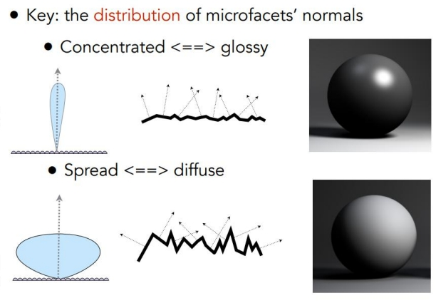
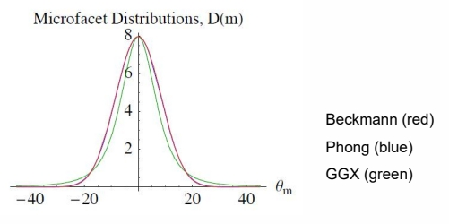

P47   
# Physical-Based Material   

P48    
## Microfacet Theory

   

   

> 微平面理论：用物体表面法向的分布来解释各种光学现象     

P49    
## BRDF Model Based on Microfacet

   

$$
L_o(x,\omega _o)=\int _{H^2}\begin{pmatrix}  
  k_d\frac{c}{\pi } +\frac{DFG}{4(\omega _o\cdot n)(\omega _i\cdot n)}
\end{pmatrix} L_i(x,\omega _i)(\omega _i\cdot n)dw_i
$$

> diffuse：漫反射与 Bling Phong 类似，简化成常数。specular：高光，比 Bling Phong 要复杂，其中 D 项与之类似。      
DFG 中每个字母代表一种光学现象。    

P50   
## Normal Distribution Function 法向分布方程     

   

   

> \\(\alpha \\) 代表 roughness，范围取 [0，1]    

   

> GGX 曲线的特点：高频更具表现力，低频不会那么快消失。    

P51   
## Geometric Attenuation Term (self-shadowing)由于表面不平导致的自遮挡

   

> 遮挡影响的特点：    
(1) 遮挡可能发生在入射光射向物体表面，也发生在反射光射向眼睛，因此要算两遍。   
(2) 与是入射光还是反射光无关    
(3) 与入／反射光与法线的夹角有关    
(4) 与 D 方式中的 (\\( \alpha \\)) 有关    

   

P52   
## Fresnel Equation

   

> 当视线与物体表面的切平面夹角很小时，反射系数会急巨增加，看到倒影效果。    
参数：\\(\alpha \\)，fresnel 系数    

   

P53   
## Physical Measured Material

   

   

> 一个关于真实材质的各项系数的数据集。    

P54   
## Disney Principled BRDF

**Principles to follow when implementing model**:   

- Intuitive rather than physical parameters should be used   
- There should be as few parameters as possible   
- Parameters should be zero to one over their plausible range   
- Parameters should be allowed to be pushed beyond their plausible range where it makes sense   
- All combinations of parameters should be as robust and plausible as possible   

P56   
## PBR Specular Glossiness

   

> 用图片方式帮助选择参数，实现 shader，把参数代入模型，计算结果。    

P57   
## PBR Specular Glossiness

P58   
## PBR Metallic Roughness

> Specular Glossiness 模型的封装版，解决其 Frenel 项炸掉的问题。灵活度下降，但不容易出问题。   

P60   
## PBR Pipeline MR vs SG

   

**MR**    
Pros    
- Can be easier to author and less prone to errors caused by supplying incorrect dielectric F0 data    
- Uses less texture memory, as metallic and roughness are
both grayscale maps    

Cons    
- No control over F0 for dielectrics in map creation. However, most implementations have a specular control to override the base 4% value   
- Edge artifacts are more noticeable, especially at lower resolutions   

**SG**   
Pros    
- Edge artifacts are less apparent    
- Control over dielectric F0 in the specular map   

Cons   
- Because the specular map provides control over dielectric F0,it is more susceptible to use of incorrect values. It is possible to break the law of conservation if handled incorrectly in the shader     
- Uses more texture memory with an additional RGB map    