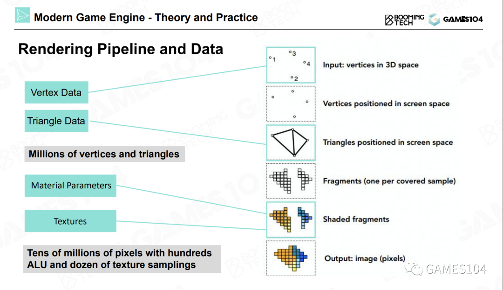
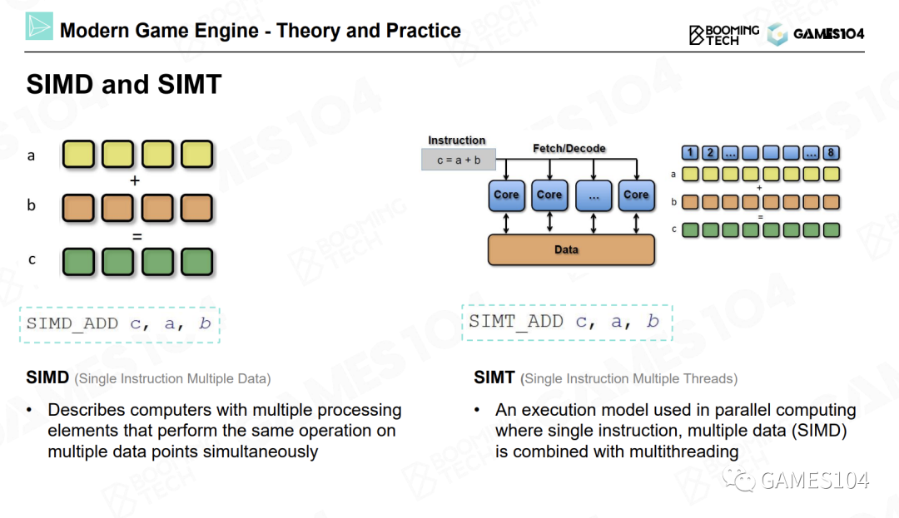

# Pipeline

绘制的最核心工作就是计算（Computation）。

- 投影。我们设定一个相机位置，然后对物体进行投影（无论是正交投影还是透视投影），就可以得到屏幕空间中的三角形。
- 光栅化。将屏幕空间中的三角形光栅化成一个个的像素。
- 着色，也叫做绘制。着色器代码将自己所处理的像素点所对应的纹理贴图上的坐标的相应位置上的颜色值取出。
**进行一次纹理采样，需要采样八个像素点的数据，并且进行七次插值运算。因此，纹理采样是绘制过程中的一个很重要的运算。**

# GPU（Graphic Processing Unit）

随着独立显卡的出现，我们可以将这些复杂的运算用一台更高效的机器进行处理，这样可以释放出大量的CPU时间。

## 基本概念

- SIMD（Single Instruction Multiple Data）

对于一个四维向量来说，每进行一次加法操作，它的XYZW坐标会同时进行运算。所以一条指令就能够完成四个加法或者四个减法运算。

- SIMT（Single Instruction Multiple Threads）

即将一个计算核心做得很小，这样可以同时提供多个计算核心，并且可以同时在多个核心上执行同一条指令。  
如果我们有100个计算核心，向这100个核心发送一条指令，就可以同时进行100次四维向量的加减。相当于将一条指令的计算效能放大了400倍。现代显卡如同一个蜂巢，其中内置了很多小型计算核心。NVIDIA的显卡中就内置了很多称为CUDA的计算核心。这就是现代显卡算力强悍的原因。

- FLOPS （floating-point operations per second）

FLOPS代表着显卡的浮点运算能力，即每秒浮点运算次数。

为什么显卡的算力能够遥遥领先于CPU呢？本质上是因为显卡中具有大量可以同时进行并行计算的小型计算核心，每个核心的功能简单，只可以进行简单的计算。而CPU的核心数量很少，但单个核心的计算能力很强。

因此显卡的并行计算能力十分强大。因此，我们在设计绘制算法的时候，要**尽可能地利用SIMT结构的优势，尽可能使用相同的代码进行并行计算**。这样一来，每个计算核心都可以分别访问自己的数据，这样可以充分发挥显卡架构的优势。

## GPU Architecture

## Cache

# 可渲染物体

