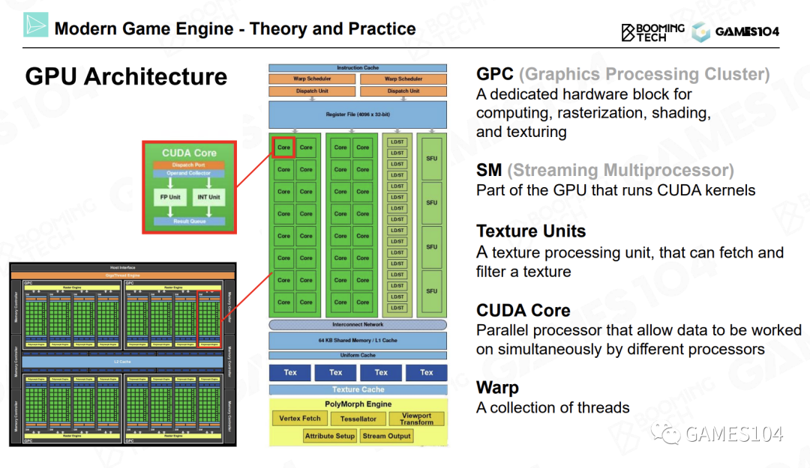
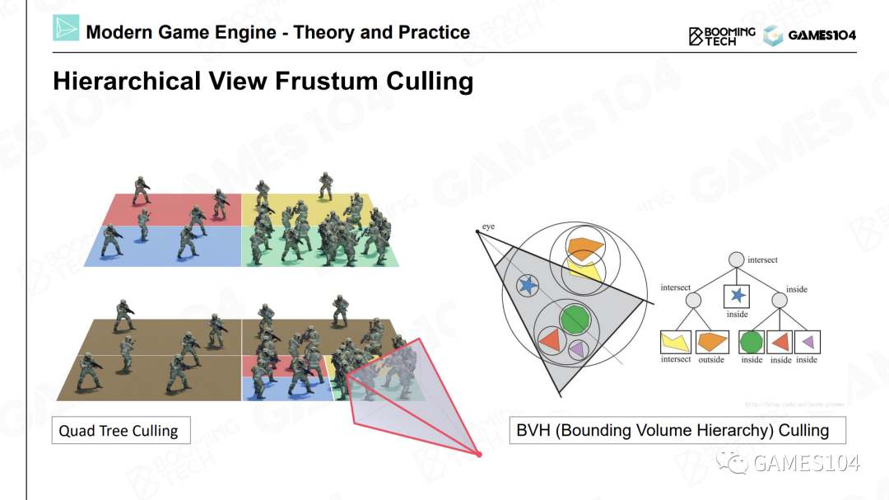
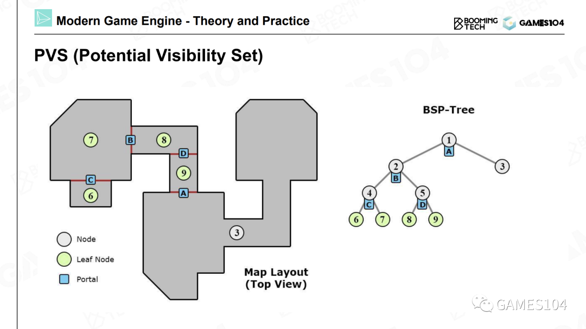
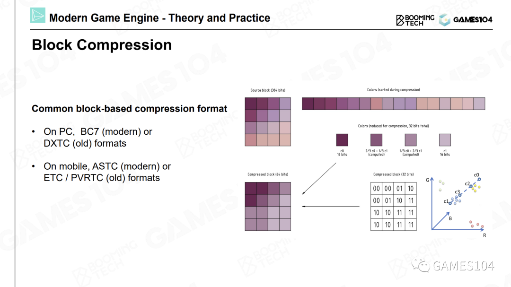
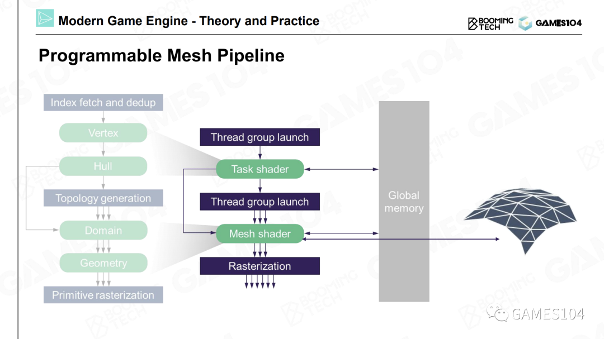

# Pipeline

绘制的最核心工作就是计算（Computation）。

- 投影。我们设定一个相机位置，然后对物体进行投影（无论是正交投影还是透视投影），就可以得到屏幕空间中的三角形。
- 光栅化。将屏幕空间中的三角形光栅化成一个个的像素。
- 着色，也叫做绘制。着色器代码将自己所处理的像素点所对应的纹理贴图上的坐标的相应位置上的颜色值取出。
**进行一次纹理采样，需要采样八个像素点的数据，并且进行七次插值运算。因此，纹理采样是绘制过程中的一个很重要的运算。**

# GPU（Graphic Processing Unit）

随着独立显卡的出现，我们可以将这些复杂的运算用一台更高效的机器进行处理，这样可以释放出大量的CPU时间。

## 基本概念

- SIMD（Single Instruction Multiple Data）

对于一个四维向量来说，每进行一次加法操作，它的XYZW坐标会同时进行运算。所以一条指令就能够完成四个加法或者四个减法运算。

- SIMT（Single Instruction Multiple Threads）

即将一个计算核心做得很小，这样可以同时提供多个计算核心，并且可以同时在多个核心上执行同一条指令。  
如果我们有100个计算核心，向这100个核心发送一条指令，就可以同时进行100次四维向量的加减。相当于将一条指令的计算效能放大了400倍。现代显卡如同一个蜂巢，其中内置了很多小型计算核心。NVIDIA的显卡中就内置了很多称为CUDA的计算核心。这就是现代显卡算力强悍的原因。

- FLOPS （floating-point operations per second）

FLOPS代表着显卡的浮点运算能力，即每秒浮点运算次数。

为什么显卡的算力能够遥遥领先于CPU呢？本质上是因为显卡中具有大量可以同时进行并行计算的小型计算核心，每个核心的功能简单，只可以进行简单的计算。而CPU的核心数量很少，但单个核心的计算能力很强。

因此显卡的并行计算能力十分强大。因此，我们在设计绘制算法的时候，要**尽可能地利用SIMT结构的优势，尽可能使用相同的代码进行并行计算**。这样一来，每个计算核心都可以分别访问自己的数据，这样可以充分发挥显卡架构的优势。

## GPU Architecture

- ALU（Arithmetic Logic Units，算术逻辑单元）
- SFU（Special Function Unit，特殊功能单元）：专门的硬件处理各种耗时的纹理采样工作，以及一些比较复杂的数学运算。比如正弦、余弦、指数、对数等超越函数运算。
- RT Core：用来加速光线追踪BVH算法的硬件逻辑电路。

在GPU上的运算都会被分配到每个流式多处理器上进行处理。而流式多处理器中的几十个核心不仅可以进行并行处理，相互之间还可以交换数据，从而进行协作。

## 数据传输

我们一直使用的都是冯洛伊曼架构，即将计算和数据分开。这样的架构会让硬件设计变得非常简单。  
冯洛伊曼架构的最大问题是，每一次计算，都需要去获取数据。但是获取数据的操作速度非常慢，而且数据在不同的计算单元（例如CPU和GPU）之间搬来搬去也是非常之慢。  

这一过程存在一个非常严重的问题，在现在引擎架构中，绘制和逻辑通常是不同步的。如果有一步绘制运算需要等待数据，则可能会导致半帧到一帧的延迟（Latency）。

因此，在游戏引擎的绘制系统架构中有一个原则，就是**尽可能将数据单向传输**。即CPU将数据单向发送到显卡，并且尽可能不要从显卡中回读数据。这也是现代计算机结构对渲染系统设计的一个限制。

# Cache

 缓存对于现代计算的性能影响是非常大的，可能远远超过大家的想象。这也是**数据一定要放在一起的原因，其实就是为了缓存去做这样的准备**。因为数据连贯性对于缓存来说非常重要。如果有些数据过大，那么也会导致缓存很难被利用好。

# 可渲染物体

## 网格在游戏引擎中如何表示

- 顶点位置：用索引数据（Index Data）和顶点数据（Vertex Data）来定义三角形的信息
- 顶点处的法线朝向：使用邻近的几个三角形的法向量进行平均得到的法向量在硬表面（比如立方体）的折线处会出错，因此建议自己定义法向
- 顶点的UV坐标
- 材质：绘制系统中定义的材质表达的是物体的视觉属性，而不是物理材质中表达的物理属性
- 纹理：人眼对于材质类型的感知（即看起来像金属还是像生锈的非金属表面）并不是由材质的参数决定的，很多时候是由它的纹理所决定的
- 其他各种各样的属性

## 着色器对效果进行计算

Shader的神奇之处在于，Shader是一段代码，因为我们需要编写大量的代码来表达材质，但是在游戏引擎中又会被当成数据来处理。

绘制一个物体的流程大致如下：
- 首先告诉显卡需要绘制的具体物体，
- 然后传入物体的纹理，
- 还需要传入一小段代码，我们一般称为一个Block（一个二进制的数据块），这就是我们编译好的一段Shader代码。
- 显卡会使用这段Shader代码，将这些元素融合到一起，
- 进行一些计算，绘制出我们想要的效果。

Shader Graph：当艺术家想表达各种各样的材质时，会像搭积木一样，将各种元素按照自己的方法进行组合。组合完之后，引擎就会生成一段Shader代码，而这段Shader代码又会被编译成一个Block，和网格存储在一起。各种各样的网格和Shader代码组合在一起，就形成了多彩的游戏世界。因此，着色器代码也是一种关键的可渲染数据。

## Submesh

每个对象上的网格，我们会根据所应用材质的不同，把其切分成很多子网格。然后对于每个子网格，分别应用各自的的材质、纹理和着色器代码。

## 池(Pool)

很多数据中的网格、贴图和着色器都是一样的，为了节约空间，在现代游戏引擎中，通用的做法是建立一个池（Pool）。  
将所有的网格放到一起，形成一个网格池；将所有的纹理放在一起，也形成一个纹理池。尤其是着色器，也有一个池。  
对象都是以引用的方式使用这些池里的数据。

总结：  
- 首先，按照材质将对象切分成子网格。
- 将相同的材质全部归类到一起，相同的纹理也归类到一起，用一个池进行管理。然后，将相同的网格也放到一起，也使用一个池进行管理。
- 当绘制物体时，到相应的池中寻找对应的数据即可。

# 可见性剪裁

只有位于视锥体中的物体才会被显示到屏幕上。

每个物体都有一个包围盒，我们可以通过一些简单的数学运算，判断物体的包围盒是否位于视锥中。这就是可见性裁剪的基础思想。

包围盒：AABB, OBB, Sphere, Convex Hull  
相交计算：BVH  

  

裁剪算法：PVS  

  

遮挡优化：Early-z

**千万不要用老的算法去限制你的想法，一定要拥抱硬件的最新变化。**

# 纹理压缩

在游戏引擎中，我们一般会将纹理压缩存储。但不能使用一些流行的、非常优秀的算法对图片进行压缩，因为经过这些算法压缩后的图片无法进行随机访问。

在游戏引擎中，我们一般采用基于块（Block Based）的压缩方法。我们将图片切成一个个小方块，最经典的就是4×4的小方块，然后进行压缩。

## 一个非常经典的算法

在一个4×4的色块中，可以找到最亮的点和最暗的点，即颜色最鲜艳和颜色最暗的点，然后将该方块中的其他点都视为这两个点之间的插值。因为对于很多图片来说，相邻的像素之间都有一定的关联度（Coherence）。所以我们可以存储一个最大值和一个最小值，然后为每个像素存储一个距离最大值和最小值的比例关系，这样就可以近似地表达整个色块中的每个像素的颜色值。

## DXT系列的压缩算法

DXT系列压缩算法的优势在于，当生成了一个纹理后，就可以在CPU上对纹理进行实时压缩。无论是压缩还是解压缩，这一系列算法的效率都非常高。

## ASTC算法

手机上使用的压缩算法。ASTC压缩的分块就不再是严格的4×4了，它可以使用任意的形状。  

优点：ASTC的压缩效果是最好的，解压缩的效率也不低。  
缺点：压缩时的性能消耗较大，因此无法在运行中进行压缩。

# Cluster-Based Pipeline

面对一个非常精细的模型时，我们可以将其分成一个个小的分块，可以称之为**Meshlet**或者**Cluster**。而每一个Meshlet都是固定的，比如32个或者64个三角形大小。    
因为当我们将每个Meshlet的大小固定之后，在显卡上的计算都是极其高效且一致的。

壳着色器（Hull Shader）、域着色器（Domain Shader）和几何着色器（Geometry Shader），这类Shader的核心想法是，我们可以**使用一个算法，基于数据凭空生成很多几何细节，而且可以根据距离相机的远近，选择所生成的几何细节的精度**。

优点：可以产生无数的细节，并且可以让艺术家自由发挥。这是一个非常值得大家关注的引擎的一个前沿的发展方向。  
缺点：基于Cluster或者Meshlet的管线对于程序员的要求要比以前高很多。因为我们要进行大量的处理和运算，而且具体实现代码也不易理解。

# Nanite

虚幻引擎的Nanite，它实现了像素级的网格密度。可以认为，Nanite是将Meshlet的思想又往前深入了一步，做的更加工业化、更加成熟。这也是现代引擎的渲染管线发展的一个重要方向。

# 总结

第一，游戏引擎的绘制系统是一个工程科学，并且深度依赖于你对现代图形硬件的理解。因此如果你想成为一个图形工程师，你必须要理解显卡的架构，知道显卡的性能卡点在哪里，了解各种性能限制。

第二，在游戏中，我们要解决的核心问题就是网格模型、材质等数据之间的关系。最经典Mesh和Submesh就是一个非常好的解决方案。但是最前沿的技术会有所不同。

第三，在进行绘制的时候，尽可能的通过一些运算（剪枝）减少绘制工作，这样能够达到最佳性能。

最后，也是非常重要的一个趋势，即越来越多的绘制运算，包括一些复杂的处理，都已经从CPU转移到GPU，以利用现代GPU的高速处理能力。这就是GPU驱动（GPU-Driven）的思想，即将很多在CPU上进行的一些复杂运算（比如动画系统等）全部转移到显卡。这也是利用GPU帮助CPU分担负载的一个重要的方式。