# Simple Light Solution

P12    
## Simple Light Solution

- Using simple light source as main light    
- Directional light in most cases    
- Point and spot light in special case    
- Using ambient light to hack others    
- A constant to represent mean of complex hemisphere irradiance    

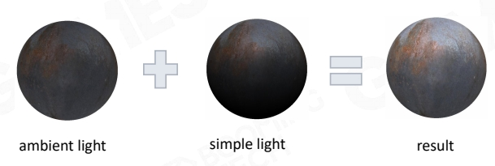     

> 假设简单场景：(1) 只有一个主光源。(2) 自定义一个常数环境光。    
ambient light：环境光，即去掉主光源后剩下的光。    

P13     
## Environment Map Reflection

- Using environment map to enhance glossary surface reflection    
- Using environment mipmap to represent roughness of surface     

     

**Early stage exploration of image- based lighting**    
   
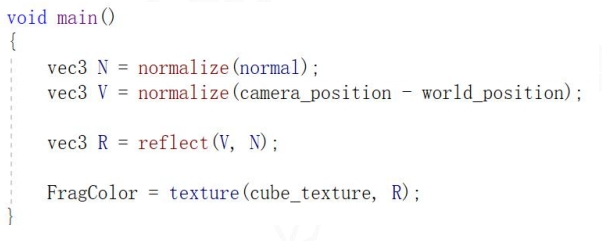      

> 增加物体反射光线的效果。    
高光：入射光方向·反射方向·物体表面法线方向重合。    
方法：六面体环境贴图 cudemap    

P14    
## Math Behind Light Combo 

- Main Light    
  - Dominant Light    
- Ambient Light    
  - Low-frequency of irradiance sphere distribution    
- Environment Map    
  - High-frequency of irradiance sphere distribution    

> 本质上，把一个半球形的光场模拟为均匀的环境光。环境光中高频内容用 envirnment map 表达。   

P15   
## Blinn-Phong Materials

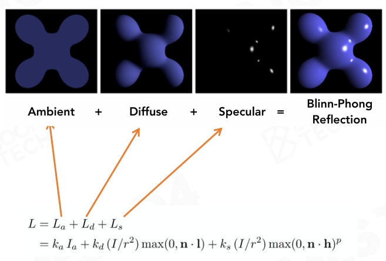   

> 光可叠加原理。    

P16   
## Problem of Blinn-Phong

- Not energy conservative   
  - Unstable in ray-tracing   

   

- Hard to model complex realistic material    

   

P17    
## Shadow    

- Shadow is nothing but space when the light is blocked by an opaque object   
- Already obsolete method   
  - planar shadow   
  - shadow volume   
  - projective texture   

   

P18    
> 从光的视角渲染一张场景深度图。   
判断真实视角下的每一个点在光视角下是否可见。若不可见，则为阴影。   

P19    
## Problem of Shadow Map

   

> 深度图的采样频率和渲染的采样频率一致，会引发 artifacts.    

P20    
## Basic Shading Solution

- Simple light + Ambient   
  - dominent light solves No.1b   
  - ambient and EnvMap solves No.3 challanges   
- Blinn-Phong material       
  - solve No.2 challange   
- Shadow map   
  - solve No.1a challange   

P21    
## Cheap, Robust and Easy Modification

P26    
# Pre-computed Global Illumination

> 假设场景中90％的东西是不动的。    
空间换时间。   
G＝全局光照＝直接光照＋间接光照    
ambient 可以做间接光照效果，但会使整个场景统一变亮，看上去会有平面感。   

P27  
## Why Global Illumination is Important

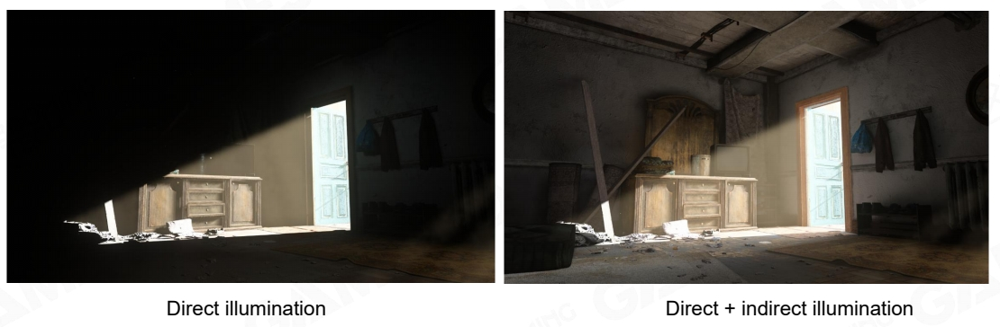   

P28   
## How to Represent Indirect Light

- Good compression rate   
  - We need to store millions of radiance probes in a level   
- Easy to do integration with material function   
  - Use polynomial calculation to convolute with material BRDF   

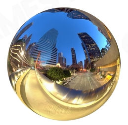   

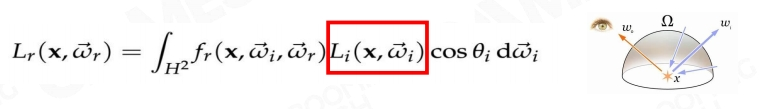   

P31    
## Spherical Harmonics

$$
Y_{lm}(\theta ,\phi )=N_{lm}P_{lm}(\cos \theta )e^{Im\phi }
$$

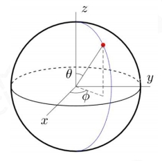

$$
\begin{align*}
 x& =  \sin \theta \cos \phi \\\\
  y &  =  \sin \theta \sin \phi\\\\
  z &  = \cos\theta
\end{align*}
$$

Complex sphere integration can be approximated by quadratic polynomial：   

$$
\int\limits_{\theta =0}^{\pi } \int\limits_{\phi  =0}^{2\pi } L(\theta,\phi )Y_{lm}(\theta ,\phi )\sin \theta d\theta d\phi \approx \begin{bmatrix}
x \\\\
y \\\\
 z\\\\
1
\end{bmatrix}^TM\begin{bmatrix}
x \\\\
y \\\\
z \\\\
1
\end{bmatrix}
$$

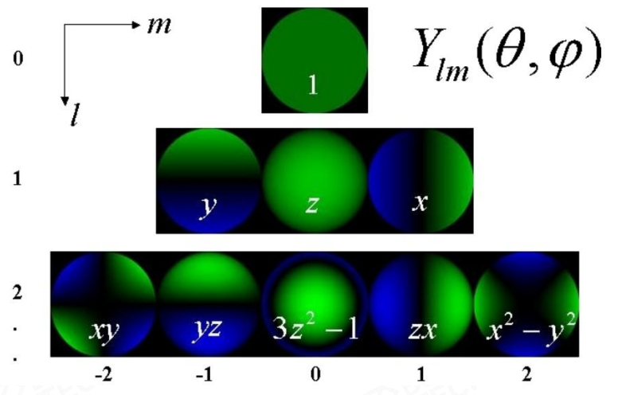

P32    
## Spherical Harmonics

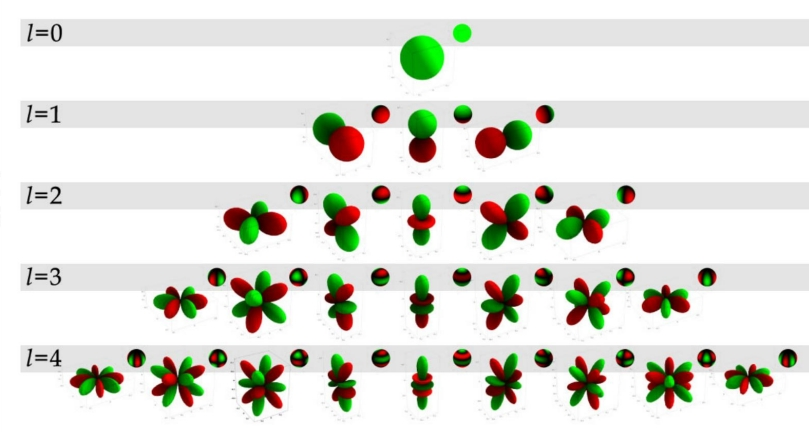

Spherical Harmonics, a mathematical system analogous to the Fourier transform but defined across    
the surface of a sphere. The SH functions in general are defined on imaginary numbers    

P33   
## Spherical Harmonics Encoding

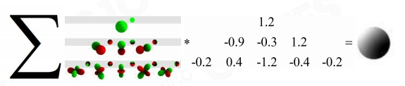

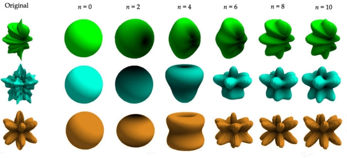

P34   
## Sampling Irradiance Probe Anywhere

  

P35   
## Compress Irradiance Probe to SH1

  

P37   

## SH Lightmap: Precomputed GI

- Parameterized all scene into huge 2D lightmap atlas    
- Using offline lighting farm to calculate irradiance probes for all surface points   
- Compress those irradiance probes into SH coefficients    
- Store SH coefficients into 2D atlas lightmap textures   

P38   
## Lightmap: UV Atlas

   

**Lightmap density**   
- Low-poly proxy geometry   
- Fewer UV charts/islands   
- Fewer lightmap texels are wasted    

P43   
## Light Probe: Probes in Game Space

   

P45    
## Reflection Probe

   

P46   
## Light Probes + Reflection Probes

- **Pros**   
  - Very efficient on runtime   
  - Can be applied to both static and dynamic objects   
  - Handle both diffuse and specular shading      

- **Cons**   
  - A bunch of SH light probes need some precomputation   
  - Can not handle fine detail of GI. I.e, soft shadow on overlapped structures   

P47   
# Physical-Based Material   

P48    
## Microfacet Theory

   

   

P49    
## BRDF Model Based on Microfacet

   

$$
L_o(x,\omega _o)=\int _{H^2}\begin{pmatrix}  
  k_d\frac{c}{\pi } +\frac{DFG}{4(\omega _o\cdot n)(\omega _i\cdot n)}
\end{pmatrix} L_i(x,\omega _i)(\omega _i\cdot n)dw_i
$$

P50   
## Normal Distribution Function

   

   

   

P51   
## Geometric Attenuation Term (self-shadowing)

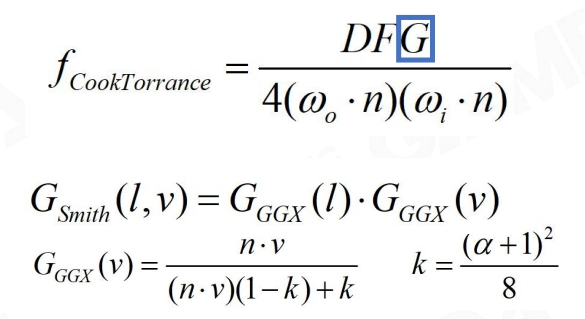   

   

P52   
## Fresnel Equation

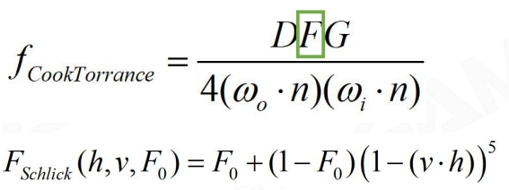   

   

P53   
## Physical Measured Material

   

   

P54   
## Disney Principled BRDF

**Principles to follow when implementing model**:   

- Intuitive rather than physical parameters should be used   
- There should be as few parameters as possible   
- Parameters should be zero to one over their plausible range   
- Parameters should be allowed to be pushed beyond their plausible range where it makes sense   
- All combinations of parameters should be as robust and plausible as possible   