# Simple Light Solution

P12    
## Simple Light Solution

- Using simple light source as main light    
- Directional light in most cases    
- Point and spot light in special case    
- Using ambient light to hack others    
- A constant to represent mean of complex hemisphere irradiance    

     

> 假设简单场景：(1) 只有一个主光源。(2) 自定义一个常数环境光。    
ambient light：环境光，即去掉主光源后剩下的光。    

P13     
## Environment Map Reflection

- Using environment map to enhance glossary surface reflection    
- Using environment mipmap to represent roughness of surface     

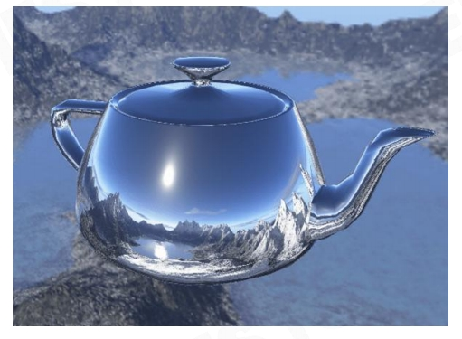     

**Early stage exploration of image- based lighting**    
   
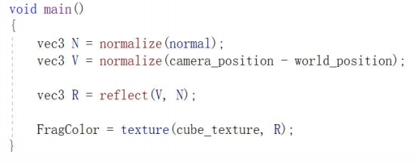      

> 增加物体反射光线的效果。    
高光：入射光方向 \\(\bullet \\) 反射方向 \\(\bullet \\) 物体表面法线方向重合。    
方法：六面体环境贴图 cudemap    

P14    
## Math Behind Light Combo 

- Main Light    
  - Dominant Light    
- Ambient Light    
  - Low-frequency of irradiance sphere distribution    
- Environment Map    
  - High-frequency of irradiance sphere distribution    

> 本质上，把一个半球形的光场模拟为均匀的环境光。环境光中高频内容用 envirnment map 表达。   

P15   
## Blinn-Phong Materials

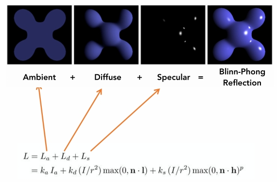   

> 光可叠加原理。    

P16   
## Problem of Blinn-Phong

- Not energy conservative   
  - Unstable in ray-tracing   

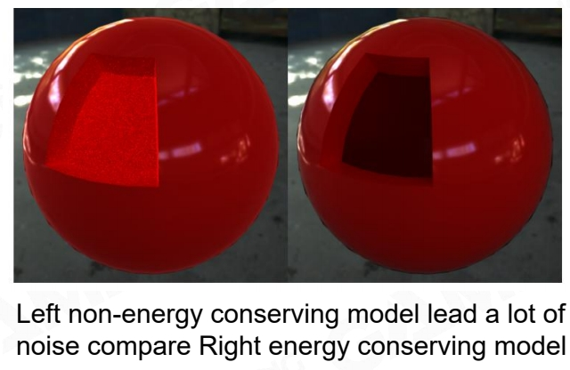   

- Hard to model complex realistic material    

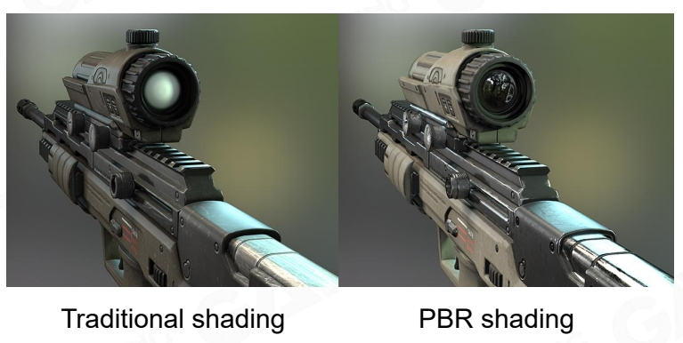   

P17    
## Shadow    

- Shadow is nothing but space when the light is blocked by an opaque object   
- Already obsolete method   
  - planar shadow   
  - shadow volume   
  - projective texture   

   

P18    
> 从光的视角渲染一张场景深度图。   
判断真实视角下的每一个点在光视角下是否可见。若不可见，则为阴影。   

P19    
## Problem of Shadow Map

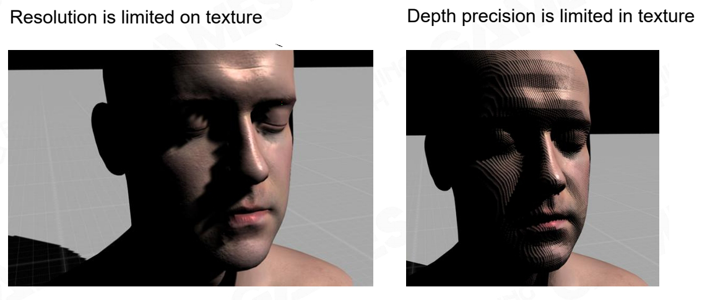   

> 深度图的采样频率和渲染的采样频率一致，会引发 artifacts.    

P20    
## Basic Shading Solution

- Simple light + Ambient   
  - dominent light solves No.1b   
  - ambient and EnvMap solves No.3 challanges   
- Blinn-Phong material       
  - solve No.2 challange   
- Shadow map   
  - solve No.1a challange   

P21    
## Cheap, Robust and Easy Modification

P26    
# Pre-computed Global Illumination

> 假设场景中90%的东西是不动的。    
空间换时间。    
GI = 全局光照 = 直接光昭 + 间接光照    
ambient 可以做间接光照效果，但会使整个场景统一变亮。看上去会有平面感。    
因此，全局光照对真实感非常重要。

P27  
## Why Global Illumination is Important

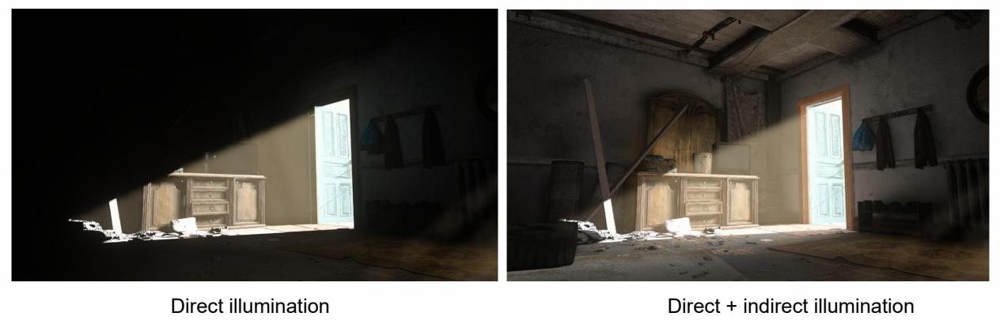   
  

P28   
## How to Represent Indirect Light

- Good compression rate   
  - We need to store millions of radiance probes in a level   
- Easy to do integration with material function   
  - Use polynomial calculation to convolute with material BRDF   

   

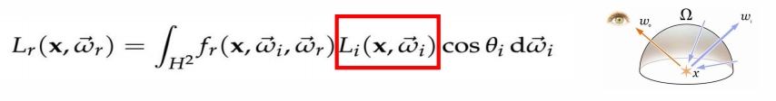   

> 预计算的GI，是对一个球面空间的采样。   
仍要解决的问题：   
(1) GI的数据量非常大。     
(2) 如何让材质与GI做积分。   
&#x1F50E;［傅利叶变换］（ \\(\quad\\) ）的作用：    
(1) 用极少的数据表达一整张图像的大致样子    
(2) 频域上的一次卷积相当于对图像域上每个像素做加权平均    

P31    
## Spherical Harmonics

$$
Y_{lm}(\theta ,\phi )=N_{lm}P_{lm}(\cos \theta )e^{Im\phi }
$$

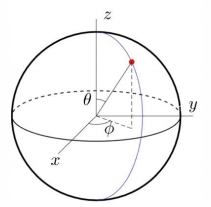

$$
\begin{align*}
 x& =  \sin \theta \cos \phi \\\\
  y &  =  \sin \theta \sin \phi\\\\
  z &  = \cos\theta
\end{align*}
$$

Complex sphere integration can be approximated by quadratic polynomial：   

$$
\int\limits_{\theta =0}^{\pi } \int\limits_{\phi  =0}^{2\pi } L(\theta,\phi )Y_{lm}(\theta ,\phi )\sin \theta d\theta d\phi \approx \begin{bmatrix}
x \\\\
y \\\\
 z\\\\
1
\end{bmatrix}^TM\begin{bmatrix}
x \\\\
y \\\\
z \\\\
1
\end{bmatrix}
$$

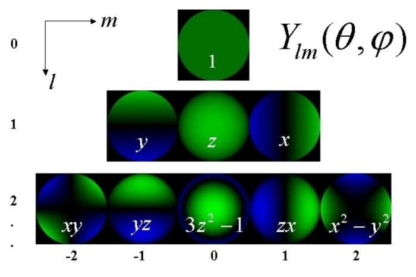

> 利用球谐函数定义了一组基，通过对球谐基的加权平均，可以组合出任意复杂的球面。       

P32    
## Spherical Harmonics

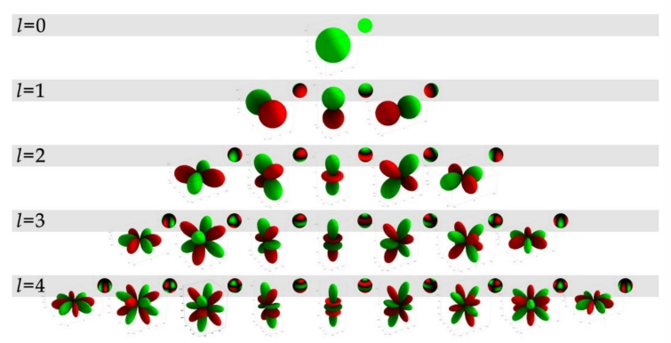

Spherical Harmonics, a mathematical system analogous to the Fourier transform but defined across    
the surface of a sphere. The SH functions in general are defined on imaginary numbers    

> 绿色表示正值，红色表示负值。   
每一个维度的所有基都是正交的。    
二阶导永远 0（光滑）。    

P33   
## Spherical Harmonics Encoding

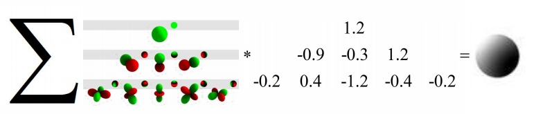

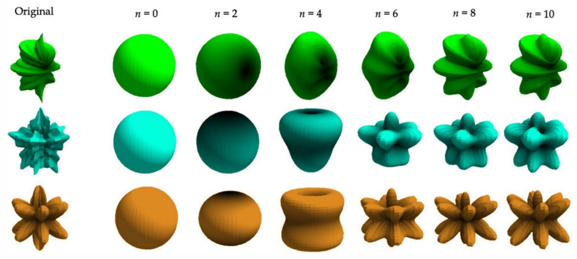

> 使用几个球谐基系数，可以把球面的光照信号大致表达出来。   
由于 GI 只需要表达低频，使用到 1 阶就足够了。    

P34   
## Sampling Irradiance Probe Anywhere

> 在任何一个点取 Irradiance Probe 信息，展开为下图    

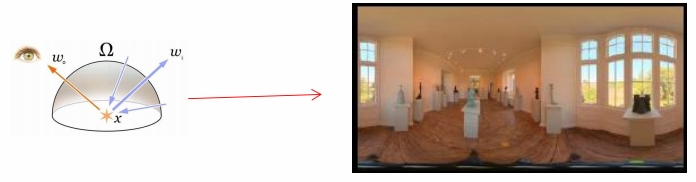  

P35   
## Compress Irradiance Probe to SH1

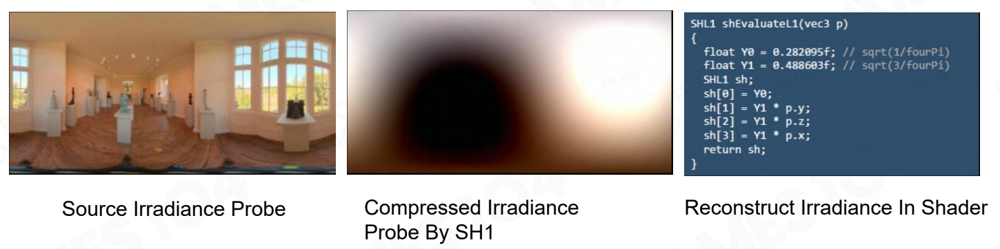  

EA. (2018). Precomputed Global Illumination in Frostbite. Retrieved from https://www.ea.com/frostbite/news/precomputed-global-illumination-in-frostbite    

> 用 1 阶球谐基(对应 4 个系数)压缩后还原得到图 2。     
图 2 足以表达光的明暗，且数据非常连续。    
通一个简单的线性运算，就可以从图中查询出任意一个方     

P37   
## SH Lightmap: Precomputed GI

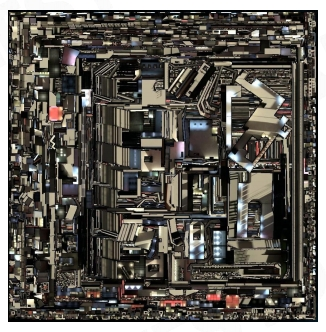

- Parameterized all scene into huge 2D lightmap atlas    
- Using offline lighting farm to calculate irradiance probes for all surface points   
- Compress those irradiance probes into SH coefficients    
- Store SH coefficients into 2D atlas lightmap textures   

P38   
## Lightmap: UV Atlas

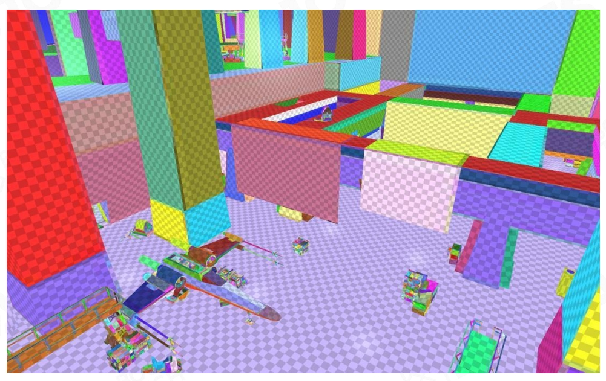   

**Lightmap density**   
- Low-poly proxy geometry   
- Fewer UV charts/islands   
- Fewer lightmap texels are wasted    

P39   
## Lightmap: Lighting

**Indirect lighting, final geometry**   
- Project lightmap from proxies to all LODs   
- Apply mesh details
- Add short-range, high￾frequency lighting detail by HBAO   

P40   
## Lightmap: Lighting + Direct Lighting

**Direct + indirect lighting,final geometry**    
- Compute direct lighting dynamically    

P41   
## Final Shading with Materials

**Final frame**    
- Combined with materials   

P42   
## Lightmap

- **Pros**   
  - Very efficient on runtime   
  - Bake a lot of fine details of GI on environment   
- **Cons**   
  - Long and expensive precomputation (lightmap farm)   
  - Only can handle **static scene and static light**   
  - Storage cost on package and GPU   

P43   
## Light Probe: Probes in Game Space

   

P45    
## Reflection Probe

   

> Reflection Probe 的特点：    
(1) 数量少    
(2) 精度高，因为高光对高频很敏感。    

P46   
## Light Probes + Reflection Probes

- **Pros**   
  - Very efficient on runtime   
  - Can be applied to both **static and dynamic objects**   
  - Handle both diffuse and specular shading      

- **Cons**   
  - A bunch of SH light probes need some precomputation   
  - Can not handle fine detail of GI. I.e, soft shadow on overlapped structures   

P47   
# Physical-Based Material   

P48    
## Microfacet Theory

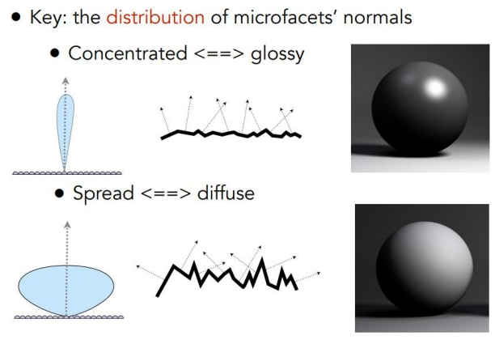   

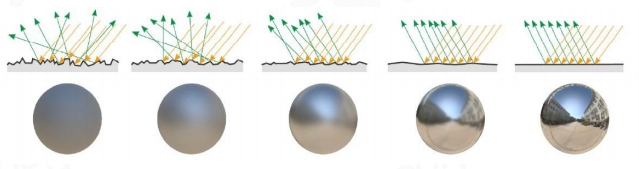   

> 微平面理论：用物体表面法向的分布来解释各种光学现象     

P49    
## BRDF Model Based on Microfacet

   

$$
L_o(x,\omega _o)=\int _{H^2}\begin{pmatrix}  
  k_d\frac{c}{\pi } +\frac{DFG}{4(\omega _o\cdot n)(\omega _i\cdot n)}
\end{pmatrix} L_i(x,\omega _i)(\omega _i\cdot n)dw_i
$$

> diffuse：漫反射，specular：高光    
PPT 中的单词写错了。    
DFG 中每个字母代表一种光学现象。    

P50   
## Normal Distribution Function

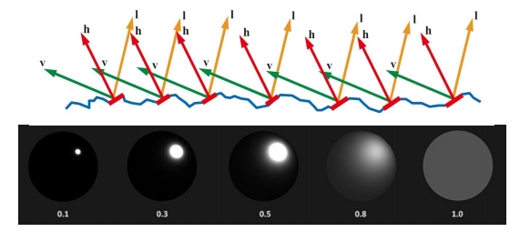   

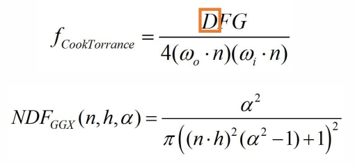   

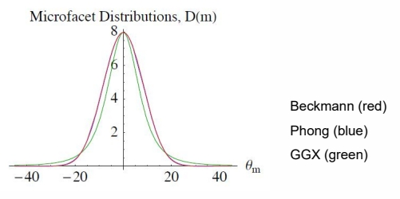   

> 法向分布方程     
\\(\alpha \\) 代表 roughness，范围取 [0，1]    
GGX 曲线的特点：高频更具表现力，低频不会那么快消失。    

P51   
## Geometric Attenuation Term (self-shadowing)

   

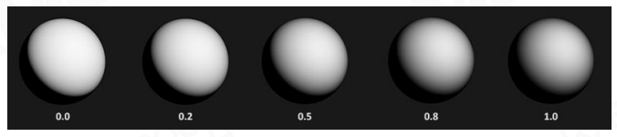   

> 由于表面不平导致的自遮挡。    
遮挡影响的特点：    
(1) 遮挡可能发生在入射光射向物体表面，也发生在反射光射向眼睛，因此要算两遍。   
(2) 与入／反射光的入／反射无关    
(3) 与入／反射光与法线的夹角有关    
(4) 与 D 方式中的 \\(\alpha \\) 有关    

P52   
## Fresnel Equation

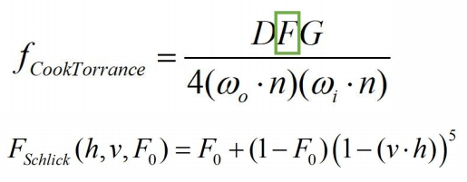   

   

> 当视线与物体表面的切平面夹角很小时，反射系数会急巨增加，看到倒影效果。    
参数：\\(\alpha \\)，fresnel 系数    

P53   
## Physical Measured Material

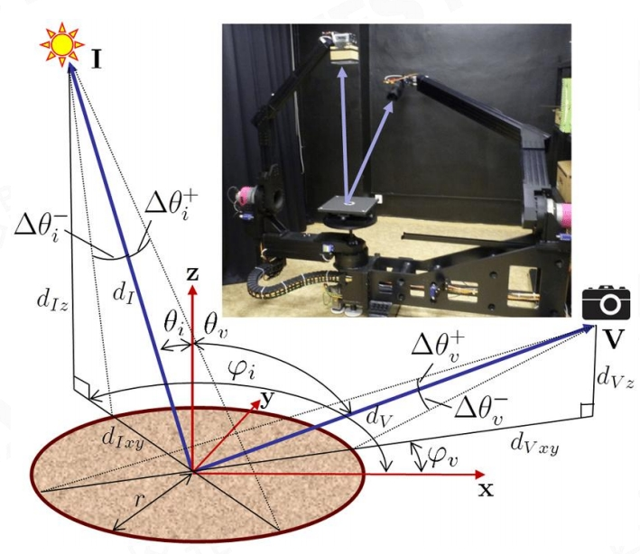   

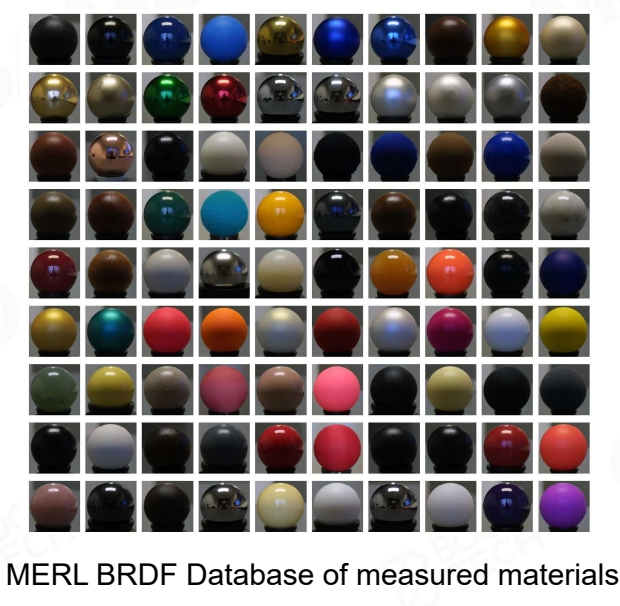   

> 一个关于真实材质的各项系数的数据集。    

P54   
## Disney Principled BRDF

**Principles to follow when implementing model**:   

- Intuitive rather than physical parameters should be used   
- There should be as few parameters as possible   
- Parameters should be zero to one over their plausible range   
- Parameters should be allowed to be pushed beyond their plausible range where it makes sense   
- All combinations of parameters should be as robust and plausible as possible   

P56   
## PBR Specular Glossiness

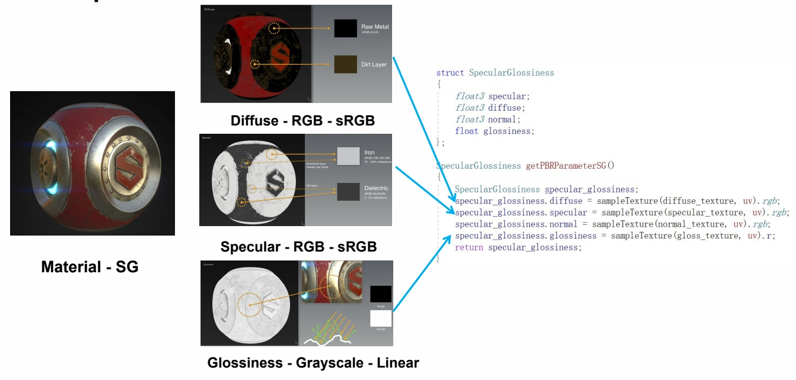   

> 用图片方式帮助选择参数，实现 shader，把参数代入模型，计算结果。    

P57   
## PBR Specular Glossiness

P58   
## PBR Metallic Roughness

> Specular Glossiness 模型的封装版，解决其 Frenel 项炸掉的问题。灵活度下降，但不容易出问题。   

P60   
## PBR Pipeline MR vs SG

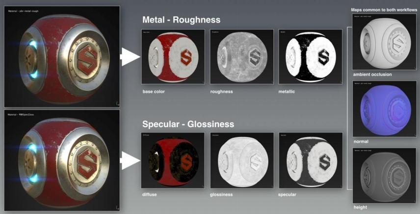   

**MR**    
Pros    
- Can be easier to author and less prone to errors caused by supplying incorrect dielectric F0 data    
- Uses less texture memory, as metallic and roughness are
both grayscale maps    

Cons    
- No control over F0 for dielectrics in map creation. However, most implementations have a specular control to override the base 4% value   
- Edge artifacts are more noticeable, especially at lower resolutions   

**SG**   
Pros    
- Edge artifacts are less apparent    
- Control over dielectric F0 in the specular map   

Cons   
- Because the specular map provides control over dielectric F0,it is more susceptible to use of incorrect values. It is possible to break the law of conservation if handled incorrectly in the shader     
- Uses more texture memory with an additional RGB map    

P61   
## Image-Based Lighting (IBL)

P62    
## Basic Idea of IBL

> 对真实的环境光照做预处理，快速地计算环境光照与材质之间的卷积。    
SH 的局限性：SH 的表达比较粗糙，只能有明暗的感觉，达不到场景细节感和凹凸感的效果。    

P64   
## Diffuse Irradiance Map

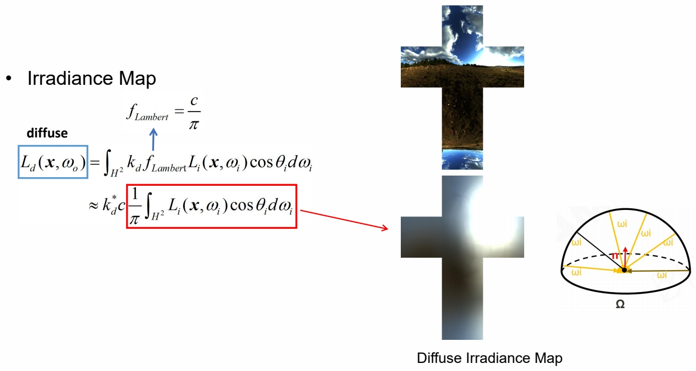   

> 根据上文可知，\\(L_o（x，W_o）\\) 可以分为 diffuse 项和 specular 项。
Diffuse 须提前把卷积结果算好存下来。实时渲染时查表即可。    

P65   
## Specular Approximation

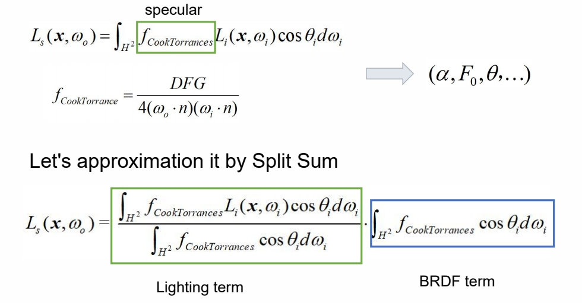   

> Specular 项的推导比较复杂，且做了大量假设和近似。    
但 specular 结果与参数 roughness 有关。因此将不同 roughness 的结果存到了不同的 mipmap 中。因为，roughness 越大，对光的敏感度越低，可以放到 mipmap 的最低级。    
方法详见 GAMES 201。   

P66   
## Approximation: part (1/2)

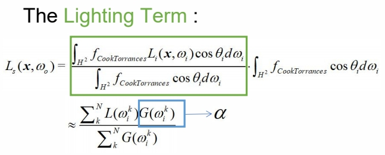   

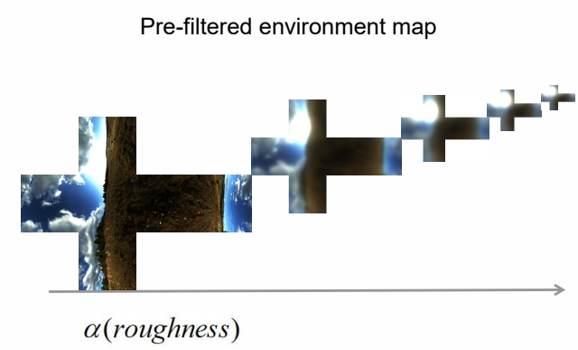   

P67   
## Approximation: part (2/2)

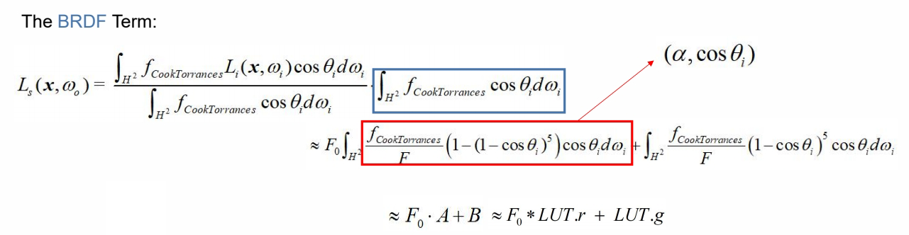   

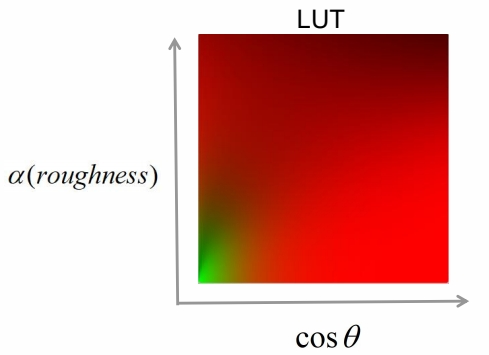   

P68   
## Quick Shading with Precomputation

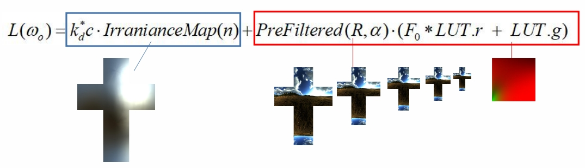   

P69   
## Shading PBR with IBL

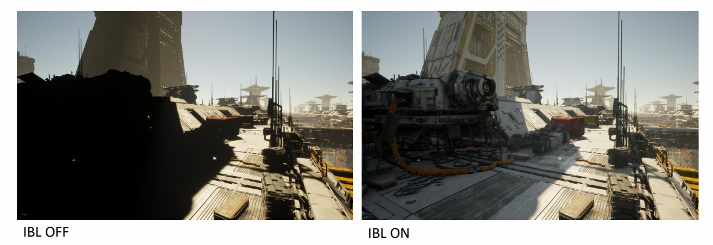   

P70   
## Classic Shadow Solution

P71    
## Big World and Cascade Shadow

- Partition the frustum into multiple frustums   
- A shadow map is rendered for each sub frustum   
- The pixel shader then samples from the map that most closely matches the required resolution    

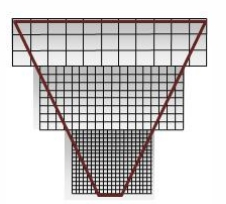   

> 不同远近的物体的 shadow，对精度的要求是不一样的。这样，近处 shadow 足够清晰，远处 shadow 足够稀疏。     

P73   
## Blend between Cascade Layers

1. A visible seam can be seen where cascades overlap    
2. between cascade layers because the resolution does not match    
3. The shader then linearly interpolates between the two values based on the pixel's location in the blend band    

P74    
## Pros and Cons of Cascade Shadow

- Pros
  - best way to prevalent errors with shadowing: perspective aliasing    
  - fast to generate depth map, 3x up when depth writing only   
  - provide fairly good results   
- Cons   
  - Nearly impossible to generate high quality area shadows   
  - No colored shadows. Translucent surfaces cast opaque shadows   

P75   
## Hard Shadow vs Realistic Shadow

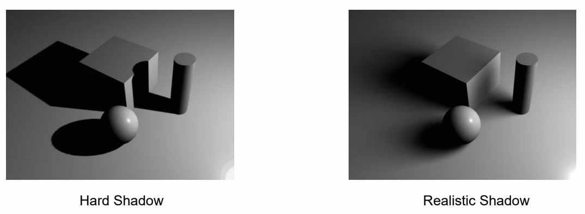   

P76   
## PCF - Percentage Closer Filter

- **Target problem**   
  - The shadows that result from shadow mapping aliasing is serious   
- **Basic idea**   
  - Sample from the shadow map around the current pixel and compare its depth to all the samples    
  - By averaging out the results we get a smoother line between light and shadow    

  

> 用滤波的法做软阴影。    

P77    
## PCSS - Percentage Closer Soft Shadow

- **Target problem**   
  - Suffers from aliasing and under sampling artifacts   
- **Basic idea**   
  - Search the shadow map and average the depths that
are closer to the light source   
  - Using a parallel planes approximation   

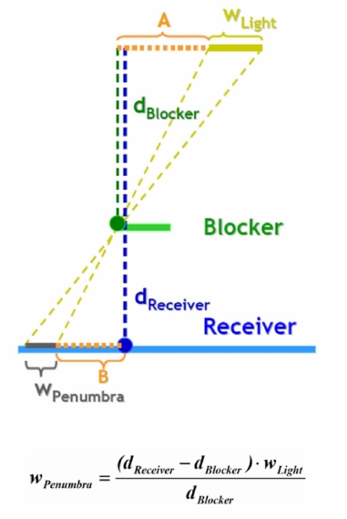   

P78    
## Variance Soft Shadow Map

- **Target problem**   
  - Rendering plausible soft shadow in real-time    
- **Basic idea**   
  - Based on Chebyshev‘s inequality, using the average and variance of depth, we can approximate the percentage of depth distribution directly instead of comparing a single depth to a particular region(PCSS)     

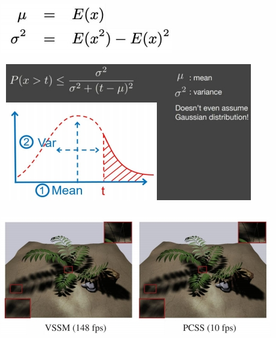   

P79    
## Summary of Popular AAA Rendering

光：Lightmap + Light probe    
材质： PBR + IBL(环境光)    
阴影：Cascade shadow + VSSM   

P80    
# Moving Wave of High Quality

P81   
## Quick Evolving of GPU

- More flexible new shader model   
  - Compute shader   
  - Mesh shader   
  - Ray-tracing shader   
- High performance parallel architecture   
  - Warp or wave architecture   
- Fully opened graphics API    
  - DirectX 12 and Vulkan   

P82   
## Real-Time Ray-Tracing on GPU

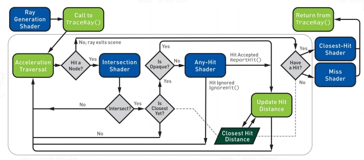   

P83   
## Real-Time Global Illumination

Screen-space GI    
SDF Based GI   
Voxel-Based GI（SVOGI/VXGI）   
RSM / RTX GI   

P86    
## Shader Management

P90    
## Uber Shader and Variants

A combination of shader for all possible light types, render passes and material types   

- Shared many state and codes    
- Compile to many variant short shaders by pre-defined macro   

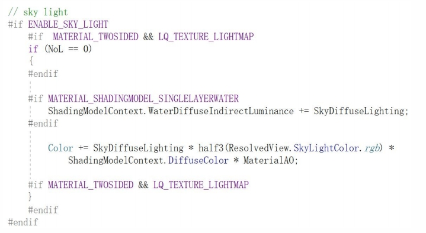   

> 利用 uber 写好少量 shader 模版，然后自动生成大量 shader.    

P92   
## Cross Platform Shader Compile

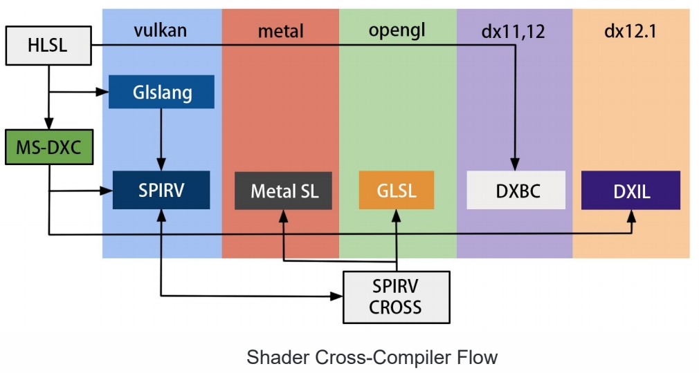   
