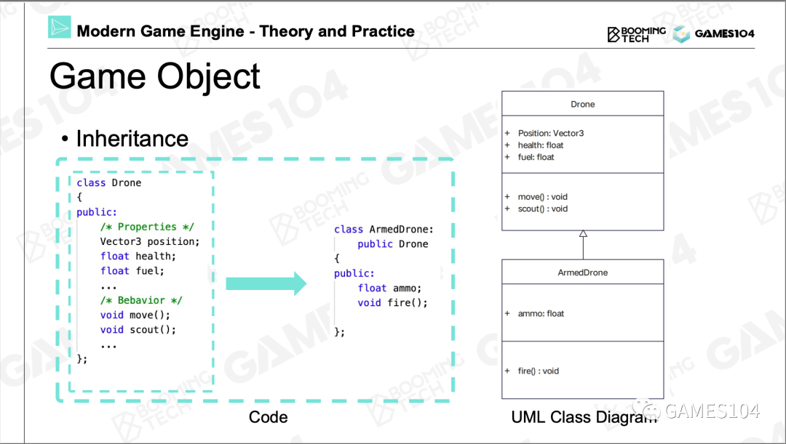
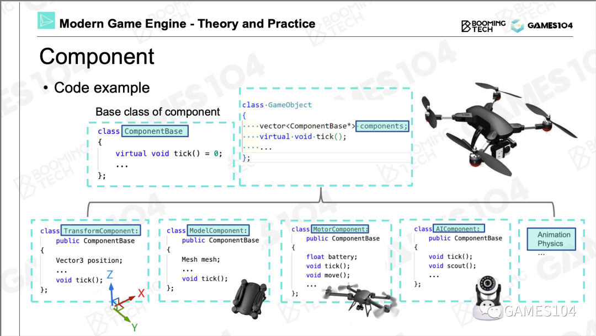
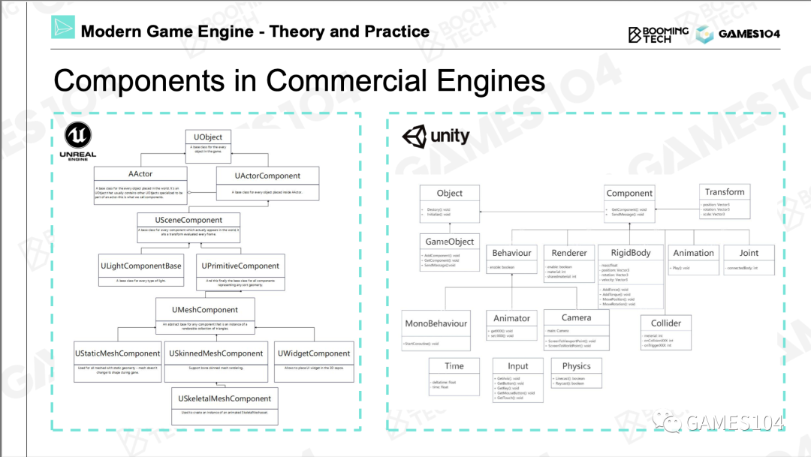
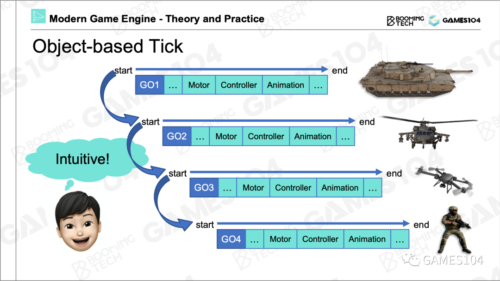
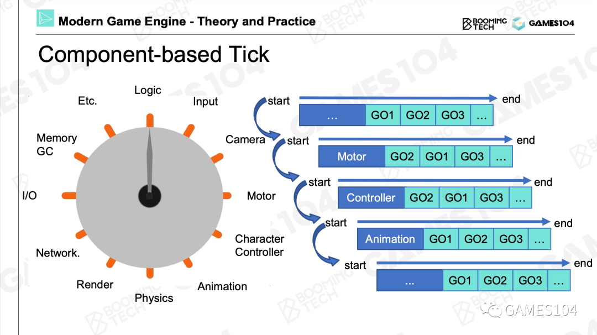
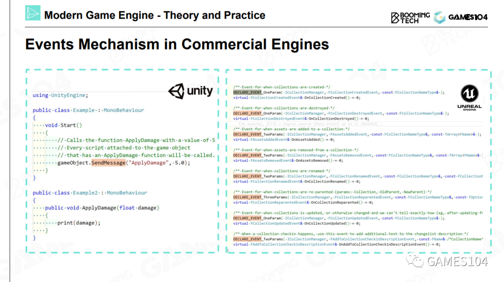
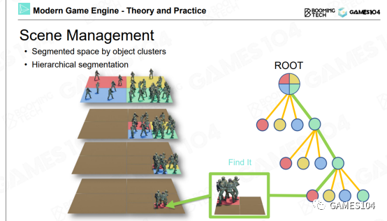
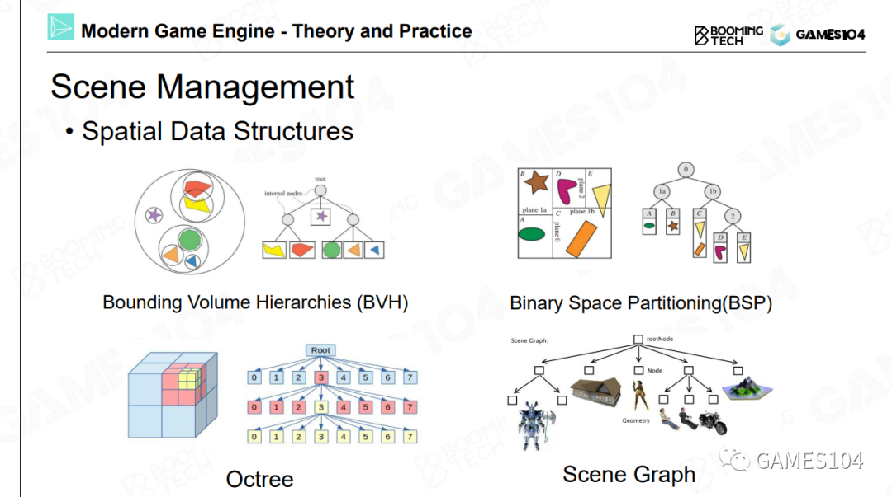

# 游戏世界的组成

## 游戏对象Game Object (GO)

所有的动靜态物体统称为游戏对象Game Object (GO)

- 可交互的动态物
- 默默的静态物
- 动静结合态系统，例如植被
- 检测体

*大地和天空系统是独立的*

GO的成员可以归类成两类，一类叫做属性，另一类叫做行为。

每个对象都有一个属性叫做GUID，这是这个对象的全局唯一标识。  

## 组件化

用面向对象的逻辑去构建这个世界有一个缺陷：随着游戏世界越来越复杂，有些东西它并没有那么清晰的父子关系。

这个问题有一个经典的解法，叫做组件化。

|面向对象|组件化|
|---|---|
|||

### 商业引擎中的组件化结构

|UE|Unity|作用|
|---|---|---|
|UObject|Object|所有对象的基类，用于对象的生命周期的管理|
|AActor|GameObject|相当于本文中的GO|
|UActorComponent|Component|相当于本文中的组件|

## 总结

第一，游戏世界里面几乎把所有的东西抽象成了游戏对象Game Object （GO）这样一个东西。第二，每个GO用各种各样多功能的组件把它组合起来，所以各种组件又是游戏对象的原子，如果这两件事情明白了，你就明白了现在游戏的组合的一个基础逻辑。

# 如何让游戏世界动起来

在游戏引擎里面核心的一个函数叫做Tick，就是每隔1/30秒让这个世界往前走一步。

## Object-based Tick

在每个tick里，把每一个游戏物体的每一个组件依次去Tick一遍，世界就动起来了。

## Component-based Tick

按照每个系统或者是每一种组件进行Tick，这样效率更高

## 总结

现代游戏引擎，为了追求效率，逐渐的会转向按照每个系统或者是每一种组件进行Tick，就是造个流水线进行批处理，这样效率会特别高。

# 事件机制

到目前为止，各个对象是独立的，事件机制让各个对象之间互相影响相互关联。  

一个对象需要影响另一个对象，但不是通过hard code直接去影响。而是通过事件机制统一处理这种影响，这是对象与组件逻辑的解耦。

## 商业引擎中的事件机制

### Unity

如果GO1要对GO2产生影响，GO1需要做这些事情：
1. 注册一个事件，事件包括要影响的目标和回调函数。  
2. 然后发送事件
3. 最后销毁事件。
当GO2收到了这个事件后，激活回调函数做相应的处理。

### UE

UE使用了比较复杂的C++反射机制，其原理大同小异。  

它的本质就是让接口的消息不断扩展定义。一个可扩展的消息系统，让游戏开发者可以在我们的引擎之上不断的定制玩法和相关的各种各样的消息类型，然后他们可以定制各种各样自己想要的组件去对这些消息，让事件进行按照自己想要的逻辑的处理，这就是现在游戏引擎的核心的一个工作。

# 场景管理

当场景中的对象非常多时，查找/访问对象会成为巨大的负担。场景管理是指根据角色的位置，对角色进行递归分组，避免全局性的角色查找。  

## 均匀分组

优点：简单直观  
局限性：角色在地图里的分布通常是不均匀的。稀疏处的格子是浪费的，而密集处的格子仍然会很慢。  

## 树形结构

根据实际情况决定是否需要继续分。  
根据实际情况决定怎么分。  

# 时序的一致性问题

由于各个角色、各个组件是独立tick的，它们之间是并发关系，因此同样的输入，其结果是不确定的。    
使用“邮局”作为第三方，根据依赖关系定义发生的顺序，可以确保它的时序是严格一致的，但实际上角色之间存循环依赖。  

时序一致性问题会产生很多逻辑上的混乱性，这个混乱性在很多时候你会注意不到。但实际上的话，对游戏的影响是非常大的。
